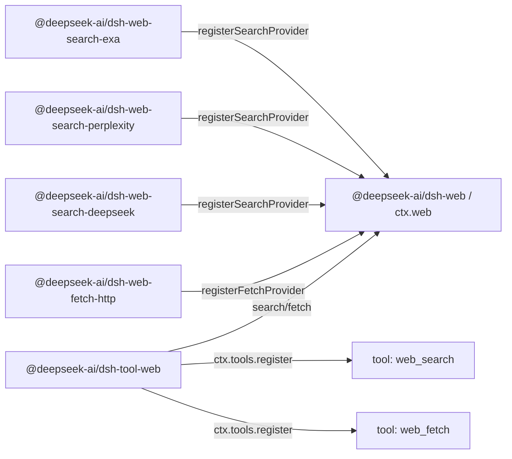

# Agent Note: Web capability seam - stable tools over multiple providers

Status: implemented

English | [中文](2026-06-24-web-capability-seam.zh.md)

## Problem

The harness needs model-facing web tools without binding the model contract to one vendor's API shape. Search is the immediate pressure point: supporting both Exa search and Perplexity search from the start — two deliberately different provider shapes (Exa returns a flat `results[]` of `{title, url, highlights, publishedDate}`; Perplexity returns a generated answer plus citations) — is what proves the normalized web contract does not just mirror one vendor. Fetch is a separate operation: an anonymous public HTTP(S) fetch backend has transport, security, redirect, decoding, and size-limit concerns that are not the same as provider-backed search.

The model-facing API must stay stable while backends change. A search provider swap should not change how the model asks for a query, and a fetch implementation swap should not change how the model asks for a URL. Conversely, a provider package should not expose its own model-facing tool schema just because it has extra provider-specific knobs.

Putting search and fetch directly in `dsh-tool-web` would make the model-facing tool own provider selection, backend request mapping, transport policy, result normalization, prompt guidance, presentation, and schema registration at once. Letting each provider register its own tool has the opposite problem: tool availability, names, descriptions, and parameters would depend on whichever provider packages happen to load, and provider-specific fields would leak into the model contract.

There is also a provider-selection question. Existing `tool-bash` and `tool-fs` can rely on Cordis `inject` because there is one backend service key. Web has two independent capabilities (`search` and `fetch`) and potentially multiple providers per capability. `inject: ['web']` proves the seam exists; it does not prove a usable search or fetch provider exists, and it does not define which provider should win when several are registered.

## Decision

Web access is a first-class capability seam following [the capability-seam Agent Note](2026-06-13-capability-seams.md):

1. `@deepseek-ai/dsh-web` (`packages/web/web`) owns `ctx.web`, provider registration, provider selection, shared request/result vocabulary, and web-specific errors.
2. Provider packages implement concrete backends and register capabilities with `ctx.web`, for example `@deepseek-ai/dsh-web-search-exa`, `@deepseek-ai/dsh-web-search-perplexity`, `@deepseek-ai/dsh-web-search-deepseek`, and `@deepseek-ai/dsh-web-fetch-http`.
3. `@deepseek-ai/dsh-tool-web` (`packages/web/tool-web`) owns the model-facing `web_search` and `web_fetch` tool schemas, prompt sections, argument validation, result formatting, and tool-owned presentation over `ctx.web`.

Providers do not register tools. Providers register capabilities. `dsh-tool-web` is the only owner of model-facing names, descriptions, prompt guidance, JSON schemas, and presentation.

Search and fetch are separate tools but one web-access seam. `ctx.web` owns provider selection, abort/error vocabulary, and deployment configuration for both parallel registries. Their request schemas and provider logic remain separate; the shared service is the product boundary for reaching the web.

`dsh-tool-web` registers model-facing web tools when the product has enabled those tools and the `ctx.web` seam is present. Backend availability is an execution-time concern, not a schema-registration concern:

- `web_search` is registered when web search is enabled for the product/app, `web_fetch` when web fetch is.
- A tool is never unregistered merely because its selected provider is missing, misconfigured, missing credentials, ambiguous, or temporarily unavailable.
- The provider is resolved at execution time, and a structured `WebError` is returned when the selected capability cannot run.

This keeps the model schema stable without making plugin load order, credential state, or HMR timing part of the model-facing contract. If web search is enabled but no usable search provider exists, `web_search` remains visible and execution fails with a structured `WebError` such as `WEB_PROVIDER_UNAVAILABLE` or `WEB_PROVIDER_CONFIGURED_UNAVAILABLE`. If a provider appears after `dsh-tool-web`, the next execution can use it without changing the schema. If a provider disappears mid-call, execution fails with a structured `WebError` instead of silently choosing another provider or falling through to `UNKNOWN_TOOL`.

The seam deliberately exposes no observation surface — no registry-change event and no aggregated capability-status query. Unavailability is a fact a caller observes by executing: `search()`/`fetch()` resolve the provider at call time and throw the structured `WebError` that names what failed. [The observation-surface Agent Note](../../archived/simplification/2026-07-04-drop-unconsumed-web-observation-surface.md) records that judgment: derived-on-call selection and enablement-based registration leave no consumer that needs a change signal or an availability probe distinct from executing and routing the error, and a future provider-status panel reintroduces the smallest signal or query it actually consumes.

## Package topology

The three-package Service Definition / Service Provider / Consumer split follows bash and filesystem, but the *interface* package is closer to the LLM seam. `LlmRuntime` (`packages/llm/llm/src/index.ts`) is a name-keyed provider registry: `registerAdapter(models, adapter)` stores adapters in a `Map`, returns a disposer, throws `DUPLICATE_ADAPTER` on duplicate keys, and throws `NO_ADAPTER` at resolution time. `ctx.web` follows that registry shape, but has two capability kinds and a richer selection policy (a configured provider id, or auto-select when exactly one usable provider is registered), so the `WebError` an execution throws can explain why a search or fetch capability cannot run.

The dependency direction mirrors bash and filesystem:

```text
@deepseek-ai/dsh-tool-web  --depends on-->  @deepseek-ai/dsh-web  <--depends on--  @deepseek-ai/dsh-web-search-exa
        consumer                                 interface                       implementation
                                                                 <--depends on--  @deepseek-ai/dsh-web-search-perplexity
                                                                                  implementation
                                                                 <--depends on--  @deepseek-ai/dsh-web-search-deepseek
                                                                                  implementation
                                                                 <--depends on--  @deepseek-ai/dsh-web-fetch-http
                                                                                  implementation
```

At runtime, provider packages register capabilities with `ctx.web`; `tool-web` registers stable tools with `ctx.tools` and executes through the seam:



`@deepseek-ai/dsh-web` depends only on Cordis and low-level harness support. It declares `ctx.web`, provider interfaces, request/result types, the provider availability contract, and error codes. It does not import tool, agent, session, LLM, or provider packages.

Provider packages depend only on `dsh-web` and Cordis. They own credentials, endpoints, wire mapping, parsing, and `WebError` translation, using platform `fetch`. Each provider injects the shared service and registers a backend; only `dsh-web` owns the `ctx.web` key. Provider-private protocol shapes do not create dependencies on `ctx.llm` or a Cordis HTTP service.

`@deepseek-ai/dsh-tool-web` depends on `@deepseek-ai/dsh-web`, `@deepseek-ai/dsh-tools`, `@deepseek-ai/dsh-system-prompt`, and Cordis. It never imports concrete provider packages.

## `ctx.web` contract

`ctx.web` is a provider registry plus a provider-selecting execution API. The registry half stays close to `LlmRuntime`: a `Map<id, provider>` per capability kind, `registerSearchProvider` / `registerFetchProvider` methods that return disposers, duplicate ids that throw `WebError`, and execution-time resolution that throws when the selected provider is absent or unusable. The authoritative signatures live in `packages/web/web/src/types.ts`; the seam's shape:

```ts
import type { WebFetchRequest, WebFetchResult, WebSearchRequest, WebSearchResult } from '@deepseek-ai/dsh-web'

interface WebSearchProvider {
  readonly id: string
  available(): boolean
  search(request: WebSearchRequest, signal?: AbortSignal): Promise<WebSearchResult>
}

interface WebFetchProvider {
  readonly id: string
  available(): boolean
  fetch(request: WebFetchRequest, signal?: AbortSignal): Promise<WebFetchResult>
}

interface WebRuntime {
  registerSearchProvider(provider: WebSearchProvider): () => void
  registerFetchProvider(provider: WebFetchProvider): () => void

  search(request: WebSearchRequest, signal?: AbortSignal): Promise<WebSearchResult>
  fetch(request: WebFetchRequest, signal?: AbortSignal): Promise<WebFetchResult>
}
```

The optional signal is execution control, not business input: `tool-web` passes `exec.signal` directly so turn cancellation, tool timeout, and agent disposal reach provider network requests, stream readers, and expensive decoding. The seam does not pass `ToolExecution` through — that would make `dsh-web` depend on `dsh-tools`.

Provider ids are stable strings and unique within their capability kind. Registering a duplicate search provider id or duplicate fetch provider id fails rather than silently replacing the old provider. Provider registration returns a disposer and follows the existing `ctx.tools.register()` / `ctx.systemPrompt.section()` pattern: the mutation is wrapped in `ctx.effect()` so the registration is torn down with the contributing fiber.

## Provider availability and selection

Provider availability and capability selection are separate concepts, but both stay minimal. A provider reports only whether that concrete implementation is usable by cheap local checks such as credential presence or parseable endpoint config. A provider `available()` must not make network calls.

`LlmRuntime` has no status type at all: availability is expressed as registry membership plus a resolution-time throw. `ctx.web` follows the same discipline. The seam exposes no aggregated capability-status query — `search()` / `fetch()` derive the selection on each call from the configured provider id, the registered providers, and each provider's cheap local `available()` boolean, and a selection failure is the structured `WebError` thrown at execution time. A caller that needs to know whether a capability can run executes and routes that error; nothing is stored as mutable service state.

The boolean is an input to selection, not a health system. `tool-web` never calls a provider's `available()` directly — its only path into the seam is `search()` / `fetch()` — so selection policy has one owner.

Selection must not depend on registration order. Cordis load order, config ordering, and HMR timing are not product semantics.

| Situation | Execution behavior |
|---|---|
| A configured provider id is registered and `available() === true` | runs that provider |
| A configured provider id is not registered | fails with `WEB_PROVIDER_CONFIGURED_MISSING` |
| A configured provider id is registered but unavailable | fails with `WEB_PROVIDER_CONFIGURED_UNAVAILABLE` |
| No provider id is configured and exactly one provider for that kind is registered and available | runs that single provider |
| No provider id is configured and no provider for that kind is registered | fails with `WEB_PROVIDER_UNAVAILABLE` |
| No provider id is configured and multiple usable providers for that kind are registered | fails with `WEB_PROVIDER_AMBIGUOUS` rather than choosing by registration order |
| No provider id is configured and providers exist but none are usable | fails with `WEB_PROVIDER_UNAVAILABLE` |

The "single provider auto-selects" rule is for tests, demos, and simple deployments. Product configs set explicit provider ids:

```yaml
- id: web
  name: '@deepseek-ai/dsh-web'
  config:
    searchProvider: exa
    fetchProvider: http

- id: web-search-exa
  name: '@deepseek-ai/dsh-web-search-exa'

- id: web-search-perplexity
  name: '@deepseek-ai/dsh-web-search-perplexity'

- id: web-search-deepseek
  name: '@deepseek-ai/dsh-web-search-deepseek'

- id: web-fetch-http
  name: '@deepseek-ai/dsh-web-fetch-http'

- id: tool-web
  name: '@deepseek-ai/dsh-tool-web'
```

Operational overrides feed the same explicit selection path: `DSH_WEB_SEARCH_PROVIDER=perplexity` is equivalent to config `searchProvider: perplexity`, not a hidden priority chain inside `dsh-tool-web`.

`ctx.web.search()` and `ctx.web.fetch()` resolve the provider at execution time using the selection rules above. If the selected capability is unavailable, they throw `WebError` with a structured code such as `WEB_PROVIDER_UNAVAILABLE`, `WEB_PROVIDER_CONFIGURED_MISSING`, `WEB_PROVIDER_CONFIGURED_UNAVAILABLE`, or `WEB_PROVIDER_AMBIGUOUS`. If no provider is explicitly configured and no usable provider exists, the execution error is the generic `WEB_PROVIDER_UNAVAILABLE` case; there is deliberately no diagnostic summary of every unavailable provider.

## Search request and result schema

The `web_search` model-facing tool is small. The only model-facing argument is:

- `query`: required string.

`max_results` is NOT exposed to the model. It is a `dsh-tool-web`-layer decision: the tool sets the result bound — the `searchMaxResults` plugin config, default `8` (aligning with OpenCode's Exa default), mirroring `dsh-tool-fs`'s `readLimit` — and passes it to the seam as `maxResults` on the `WebSearchRequest`. Keeping it off the model schema means the model just asks a question and the product controls how much context comes back; the field can be promoted to a model-facing argument later without breaking the seam.

`maxResults` flows tool → seam → provider, and the bound is enforced on the way back:

- `dsh-tool-web` owns the value and puts it on `WebSearchRequest.maxResults`.
- `ctx.web` passes the request through to the selected provider unchanged.
- A provider applies `maxResults` at the request layer when its API supports it (Exa's `numResults`), as a cost/latency optimization.
- `ctx.web` enforces the bound on the result: if a provider returns more than `maxResults` sources — because its API has no result-count control (Perplexity) or ignored the hint — the seam truncates `sources[]` to `maxResults` and sets `WebSearchResult.truncated` to `true` before returning. This makes the bound a single cross-provider guarantee the model-facing layer can rely on, rather than something each provider must remember to honor.

The seam request carries no provider-specific controls — no Perplexity model selection, search recency, domain filters, Exa `livecrawl`, Exa `type`, regional hints, generated-answer budgets, or search depth. Such a field is added only when it has provider-neutral semantics that both the tool schema and selected providers can honor honestly.

```ts
interface WebSearchRequest {
  readonly query: string
  /** Upper bound on returned sources; the seam truncates to it. Omitted = no bound. `dsh-tool-web` always sets it. */
  readonly maxResults?: number
}

interface WebSearchResult {
  readonly content?: string
  readonly sources: readonly WebSearchSource[]
  readonly truncated: boolean
}

interface WebSearchSource {
  readonly url: string
  readonly title?: string
  readonly snippet?: string
  readonly publishedAt?: string
}
```

`content` is optional provider-generated answer text, search context, or summary. `sources[]` is the portable citation shape. A source always has a URL; title, snippet, and `publishedAt` are optional because not every provider returns them. `title` is not required: Perplexity-style citations may provide only URLs, and forcing adapters to invent titles would make the seam lie. `dsh-tool-web` renders a `title ?? hostname(url)`-style fallback label for display. `publishedAt` is an optional publication/crawl timestamp as an ISO-8601 string — Exa returns it as `publishedDate` on each result and Perplexity returns a `date` on search results, so it is real provider data, not derived; the seam carries it as a string and leaves date parsing to the consumer.

Exa search maps each entry of the provider's flat `results[]` into a `WebSearchSource`: `url` ← `url`, `title` ← `title`, `snippet` ← the first `highlights[]` entry (an entry with no highlight has no portable snippet and is dropped), `publishedAt` ← `publishedDate`. Exa returns no provider-generated answer, so `content` is omitted. Perplexity search maps `choices[0].message.content` to `content` and prefers the structured top-level `search_results[]` for `sources[]` — `url` ← `url`, `title` ← `title`, `snippet` ← `snippet` (often empty), `publishedAt` ← `date` — falling back to the URL-only `citations[]` array only when `search_results` is absent (those sources carry just a `url`). If a provider returns fewer structured fields than the seam supports, the adapter omits those optional fields.

Full page retrieval remains the job of `web_fetch(url)`. Search snippets are discovery context, not fetched page bodies.

## Fetch request and result schema

The `web_fetch` implementation is an anonymous public HTTP(S) fetch provider, `http`. It fetches bytes from a concrete URL, applies the basic transport hygiene below (http/https-only, credential rejection, byte/time caps, cross-origin redirect blocking), decodes textual content, and returns only the minimal model-useful result: final URL, status code, body, and truncation. It carries no browser cookies, editor credentials, git credentials, internal auth tokens, or implicit access to private services. (Full SSRF / private-network blocking is deferred — see [Deferred work](#deferred-work).)

The seam request stays smaller than OpenCode's model-facing tool:

- `url`: required HTTP(S) URL.

The seam request deliberately does not include a per-call timeout, `format`, `prompt`, or provider-specific extraction controls. Cancellation is the direct optional execution signal, while the fetch provider owns one deployment-configured timeout backstop. `format` is a presentation decision over a fetched resource; `prompt` is a higher-level LLM summarization instruction; extraction APIs such as Firecrawl, Exa, Tavily, or Parallel may not expose a concrete HTTP response. If the product later needs provider-backed page extraction, that is a separate `web_extract` capability or a deliberate widening of this seam — extract semantics are never smuggled into `web_fetch` by making every HTTP field optional.

HTTP status is part of the fetched resource state, not automatically a tool failure. A successful network fetch of a `404` or `500` response returns `WebFetchResult` with the status code and a bounded decoded body when the content type is supported. `WebError` is for failures to safely retrieve or represent the resource: invalid or blocked URL, redirect policy violation, timeout, abort, response too large, unsupported content type, provider failure, or network failure.

```ts
export interface WebFetchRequest {
  readonly url: string
}

export interface WebFetchResult {
  readonly url: string
  readonly statusCode: number
  readonly body: WebFetchBody
  readonly truncated: boolean
}

export type WebFetchBody =
  | { readonly kind: 'html'; readonly content: string }
  | { readonly kind: 'text'; readonly content: string }
```

`WebFetchResult.url` is the final URL after allowed redirects. The request URL is already present in `WebFetchRequest`, so there is no separate `requestedUrl`/`finalUrl` pair.

`WebFetchBody` is a closed discriminated union because body kinds require coordinated changes to the seam, provider, and tool rather than independent plugin extension. Exhaustive switches make a new kind fail compilation at every renderer until handled. Separate object arms leave room for kind-specific fields.

The provider owns safe resource retrieval: URL validation, HTTP transport, redirect policy, timeout, abort propagation, byte caps, charset decoding, content-type classification, and binary rejection. `dsh-tool-web` owns presentation: HTML-to-markdown, HTML-to-text, truncation formatting for the model, and future summaries.

The fetch provider's resource controls:

- Only `http:` and `https:` URLs are accepted; credentials in URLs are rejected.
- Maximum URL length, response byte cap, decoded body character cap, timeout, and redirect hop cap are enforced.
- Abort signals propagate through network fetches and expensive decoding.
- Only same-origin redirects are followed automatically; a cross-origin redirect fails with `WEB_REDIRECT_BLOCKED`, requiring a fresh tool call and therefore a fresh provider/permission decision. (Claude Code's WebFetch uses this same model — it does not auto-follow a cross-host redirect; it returns the redirect target to the model for a fresh call.)
- Requests carry an explicit product user agent rather than silently impersonating a browser.

SSRF / private-network protection (blocking private, loopback, link-local, multicast, and otherwise non-public destinations, with DNS-resolve-then-validate to defeat rebinding and per-hop re-validation on redirects) is **deferred** — see [Deferred work](#deferred-work). Until it lands, `web_fetch` is an SSRF primitive and must not be enabled in a deployment that can reach sensitive internal network targets.

## Tool consumer behavior

`dsh-tool-web` owns two `ToolDefinition`s: `web_search` and `web_fetch`. It owns model-facing JSON schemas, snake_case argument names, prompt sections, result rendering to `ContentBlock[]`, `presentCall`, and `presentResult`.

`dsh-tool-web` must not enumerate providers or call provider `available()` directly. Its only path into the seam is `ctx.web.search()` / `ctx.web.fetch()`. That keeps provider selection in one layer; otherwise the tool package could decide one provider is usable while execution resolves a different state.

Tool registration is a minimal stable sync: on plugin startup the `dsh-tool-web` `Config` (`search?: boolean`, `fetch?: boolean`, both default `true`) enables or disables each web tool; an enabled tool is registered with a fiber-scoped disposer via the effect-based registry; neither tool is disposed merely because its selected provider is missing, unusable, or ambiguous; disposing the `tool-web` fiber tears down its registrations automatically.

Provider availability changes affect execution results and diagnostics, not whether the model-facing schema exists. If a product wants no web tools at all, it disables `dsh-tool-web` or the individual web tool in config; if it wants web tools but the backend is misconfigured, the model sees a structured tool error at execution time.

The prompt guidance explains the semantic split — `web_search` for discovery and current information, `web_fetch` when the model needs the content of a specific URL — and the prompt and tool result tell the model to cite relevant URLs with markdown links.

The model-facing output is text-first because tool results are `ContentBlock[]`, but the seam outcome stays structured so UI presentation and future adapters do not have to scrape rendered text.

## Errors

`dsh-web` defines `WebError extends HarnessError` with stable codes, covering only states that callers may reasonably branch on:

- `WEB_PROVIDER_UNAVAILABLE`
- `WEB_PROVIDER_CONFIGURED_MISSING`
- `WEB_PROVIDER_CONFIGURED_UNAVAILABLE`
- `WEB_PROVIDER_AMBIGUOUS`
- `WEB_DUPLICATE_PROVIDER`
- `WEB_INVALID_URL`
- `WEB_BLOCKED_URL`
- `WEB_REDIRECT_BLOCKED`
- `WEB_FETCH_TOO_LARGE`
- `WEB_FETCH_TIMEOUT`
- `WEB_ABORTED`
- `WEB_UNSUPPORTED_CONTENT_TYPE`
- `WEB_PROVIDER_ERROR`

`WEB_DUPLICATE_PROVIDER` is thrown synchronously from `registerSearchProvider` / `registerFetchProvider` when an id is already registered for that capability kind (the analogue of `LlmRuntime`'s `DUPLICATE_ADAPTER`); it is a registration-time programming error, not an execution outcome, but shares the `WebError` code space so callers see one taxonomy. `WEB_PROVIDER_ERROR` is the catch-all for a provider's own failure surfaced through the seam, including network/transport failure in `web-fetch-http` (DNS, connection refused, TLS); there is deliberately no separate `WEB_NETWORK` code — the provider sets a descriptive message so the model and logs can tell a network failure from a provider API failure.

Tool execution lets these errors flow through `ToolRuntime.execute()`, which already converts `HarnessError` into an error tool result with structured metadata. The model gets a readable error message; hooks, tests, and UI code can route on the stable code.

## Testing

Each layer is pinned at its own boundary: the registry/selection/truncation/abort contract and the `WebError` codes in `dsh-web`; per-provider request/response mapping over recorded fixtures (Perplexity fixtures include URL-only citations so the optional source fields stay honest) plus a self-skipping with-key smoke per real provider; real local-HTTP behavior in `web-fetch-http`; and enablement-driven registration, structured execution errors, and result formatting through the real tool registry in `dsh-tool-web`. A real-Loader smoke guards the two export shapes ([postmortem 0001](../../../../docs/postmortem/0001-acp-default-export-drops-inject.md)): `dsh-web` is a default-exported service, while the providers and `tool-web` are namespace plugins where a stray `export default` would drop `inject`.

## Alternatives considered

### Let each provider register its own model-facing tool

This matches the most flexible provider-plugin systems: every provider can expose its full native schema. It is rejected for the harness because it gives provider packages ownership of model-facing names, descriptions, prompt guidance, and result formatting. Multiple search providers would produce duplicate tool names or provider-specific tool names, and the model would learn backend details instead of a stable product capability.

### Put provider dispatch directly in `dsh-tool-web`

This resembles OpenCode's local web search: one stable `websearch` tool dispatches to Exa or Parallel internally. It is acceptable for a small product path but wrong as a harness foundation. The tool package would own provider selection, credentials, request mapping, transport, response parsing, and presentation, making it hard to add Exa and Perplexity without baking their differences into the tool schema.

### Split search and fetch into two seams (`dsh-search`, `dsh-fetch`)

Tempting because the two halves share no request schema and no business logic, so each would map cleanly onto the shell/fs three-package template, and the `Search`/`Fetch` method-pair duplication on `WebRuntime` would disappear. Rejected because the shared machinery — provider-id registry, registration-order-independent selection policy, abort propagation, the `WebError` taxonomy, and the product-facing "how this harness reaches the web" configuration API — is real and would otherwise be duplicated across two near-identical seams. One `ctx.web` middle layer gives the product a single thing to inject and configure and gives provider selection one owner. The price is the parallel `searchX`/`fetchX` method pairs, which is accepted deliberately.

### Choose the first registered provider

Rejected. Registration order is not a product policy. It can change with config order, plugin loading, HMR, or refactors. Provider selection must be explicit, or automatic only when exactly one usable provider exists.

### Treat Firecrawl/Exa/Tavily/Parallel extraction as fetch

Rejected for the first version. Those providers often return extracted or summarized content rather than a concrete HTTP response. If the product needs extraction, design `web_extract` or deliberately widen the fetch operation later.

### Mirror Claude Code's `url + prompt` WebFetch shape

Rejected for the seam. `prompt` turns fetch into LLM summarization and couples public-web retrieval to a model provider. The harness seam should fetch and decode deterministically; `dsh-tool-web` can later offer summaries as a presentation mode without making `ctx.web` depend on `ctx.llm`.

## Consequences

**The search schema is deliberately thin.** Exa and Perplexity both expose useful provider-specific controls; a control is added only once it can be defined provider-neutrally and enforced honestly by both tool registration and provider execution.

**Perplexity citations can be sparse.** A citation may be only a URL. Making `title` and `snippet` optional keeps the seam truthful but means `tool-web` renders fallback labels.

**Stable tool registration defers misconfiguration to execution.** Keeping the tool visible is correct when the product enabled web access, but product apps that expect web search should surface the structured `WEB_PROVIDER_CONFIGURED_MISSING` / `WEB_PROVIDER_CONFIGURED_UNAVAILABLE` / `WEB_PROVIDER_AMBIGUOUS` failures loudly so users do not discover setup problems only after the model calls the tool.

**Provider state can change after startup.** A tool can be visible in the request assembled at step start and lose its provider before execution. The execution path resolves again and fails with a structured error.

**Fetch is a network boundary, not just a read-only tool.** `web_fetch` can reach sensitive network targets or exfiltrate data through URLs. Only the basic transport hygiene ships (http/https-only, credential rejection, byte/time caps, cross-origin redirect blocking); SSRF / private-network blocking is deferred (see [Deferred work](#deferred-work)), so until it lands `web_fetch` must not be enabled where it can reach internal targets.

**Large web content can damage context quality.** Providers enforce byte/character caps and report `truncated`; `tool-web` formats bounded model output with clear continuation or follow-up guidance.

## Deferred work

- SSRF / private-network protection for `web_fetch`: block private, loopback, link-local, multicast, and otherwise non-public destinations so `web_fetch` is not an SSRF primitive. Doing it correctly is more than a URL-string check — it needs DNS-resolve-then-connect-to-the-validated-IP (to defeat DNS rebinding / TOCTOU), per-hop re-validation across redirects, and IPv6 edge handling (private ranges, IPv4-mapped addresses). Neither reference implementation surveyed does IP-level blocking (OpenCode does a prefix check then fetches; Claude Code relies on a centralized hostname blocklist plus a "private URLs will fail" prompt), so there is no implementation to copy and this is the harness's only SSRF defense — it warrants its own focused design/spike. Until it lands, `web_fetch` must only be enabled in deployments that cannot reach sensitive internal targets.
- A `pdf` `WebFetchBody` kind: the `http` provider decodes text-extractable PDFs (best-effort, capped, `truncated`) into a `{ kind: 'pdf'; content; pageCount? }` arm, and `tool-web` renders it. This is fetch, not `web_extract` — PDF retrieval is a concrete HTTP 200 plus deterministic local decoding, not provider-side extraction of a non-HTTP resource. Adding it is a coordinated change across `dsh-web` (declare the arm), the provider (decode + narrow "binary rejection" to "reject binary except text-extractable PDF"; scanned/image PDFs needing OCR stay out of scope), and `tool-web` (render). The closed `WebFetchBody` union makes the consumer side fail to compile until the new arm is handled.
- Provider-backed extraction as a separate `web_extract` capability, rather than widening `web_fetch` silently.
- Permission policy integration: the permission system now exists ([sandbox and approval](../feature/2026-07-06-sandbox.md), [web permission presets](../feature/2026-07-23-web-permission-and-approval.md)) but bundles only sandbox mode and approval policy; web permission policy remains unintegrated.
- Provider-neutral search controls beyond `query` and `maxResults`, once Exa and Perplexity can both honor them honestly.

## Open questions

- Should product app packages probe web configuration at startup (treating `WEB_PROVIDER_CONFIGURED_MISSING`, `WEB_PROVIDER_CONFIGURED_UNAVAILABLE`, and `WEB_PROVIDER_AMBIGUOUS` as fatal when web is explicitly configured), or leave misconfiguration to surface at the first execution?
- Where should permission policy for public web access live in the shipped permission system ([sandbox and approval](../feature/2026-07-06-sandbox.md), [web permission presets](../feature/2026-07-23-web-permission-and-approval.md)): a dedicated web permission plugin on `tools/execute`, provider config, or both?
