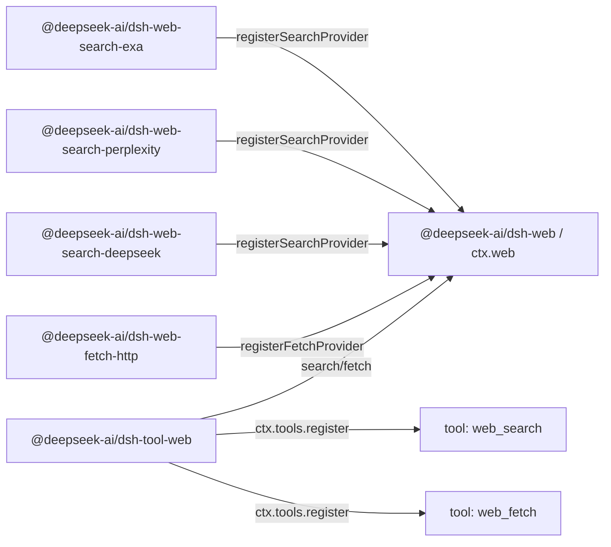

# Agent Note: Web 能力 seam——稳定的工具覆盖多个提供方

Status: implemented

[English](2026-06-24-web-capability-seam.md) | 中文

## 问题

harness 需要面向模型的 web 工具，但不能将模型约定绑定到某一家厂商的 API 形状上。搜索是当前的压力点：从一开始就同时支持 Exa 搜索和 Perplexity 搜索——两种刻意不同的提供方形状（Exa 返回扁平的 `results[]`，每项包含 `{title, url, highlights, publishedDate}`；Perplexity 返回一段生成式回答加引用列表）——正是用来证明归一化的 web 约定并非只是镜像某一家厂商。Fetch 是另一项独立操作：匿名公开 HTTP(S) fetch 后端涉及传输、安全、重定向、解码和大小限制等关注点，与提供方支撑的搜索并不相同。

面向模型的 API 必须保持稳定，而后端可以更换。更换搜索提供方不应改变模型发起查询的方式；更换 fetch 实现不应改变模型请求 URL 的方式。反过来，提供方包也不应仅仅因为自己有额外的提供方特有旋钮就暴露自己的面向模型工具 schema。

如果把搜索和 fetch 直接放进 `dsh-tool-web`，面向模型的工具就要同时承担提供方选择、后端请求映射、传输策略、结果归一化、提示词引导、展示和 schema 注册。让每个提供方注册自己的工具则有相反的问题：工具的可用性、名称、描述和参数将取决于恰好加载了哪些提供方包，提供方特有字段会泄漏到模型约定中。

还有一个提供方选择的问题。现有的 `tool-bash` 和 `tool-fs` 可以依赖 Cordis 的 `inject`，因为只有一个后端服务键。Web 有两项独立能力（`search` 和 `fetch`），每项能力可能有多个提供方。`inject: ['web']` 能证明 seam 存在，但不能证明存在可用的搜索或 fetch 提供方，也无法定义多个提供方注册时谁胜出。

## 决策

Web 访问是一个一等能力 seam，遵循[能力 seam Agent Note](2026-06-13-capability-seams.md)：

1. `@deepseek-ai/dsh-web`（`packages/web/web`）拥有 `ctx.web`、提供方注册、提供方选择、共享的请求/结果词汇，以及 web 特有的错误。
2. 提供方包实现具体后端并向 `ctx.web` 注册能力，例如 `@deepseek-ai/dsh-web-search-exa`、`@deepseek-ai/dsh-web-search-perplexity`、`@deepseek-ai/dsh-web-search-deepseek` 和 `@deepseek-ai/dsh-web-fetch-http`。
3. `@deepseek-ai/dsh-tool-web`（`packages/web/tool-web`）拥有面向模型的 `web_search` 和 `web_fetch` 工具 schema、提示词段落、参数校验、结果格式化，以及通过 `ctx.web` 实现的工具展示。

提供方不注册工具。提供方注册能力。`dsh-tool-web` 是面向模型的名称、描述、提示词引导、JSON Schema、展示的唯一所有者。

搜索和 fetch 是两个独立工具，但属于同一个 web 访问 seam。`ctx.web` 为两个并行注册表统一拥有提供方选择、abort/错误词汇和部署配置。它们的请求 schema 和提供方逻辑保持独立；共享的服务是触达 web 的产品边界。

`dsh-tool-web` 在产品启用了相应工具且 `ctx.web` seam 存在时注册面向模型的 web 工具。后端可用性是执行时关注点，而非 schema 注册时关注点：

- `web_search` 在产品/应用启用了 web 搜索时注册，`web_fetch` 在启用了 web fetch 时注册。
- 工具绝不会仅仅因为其选定的提供方缺失、配置错误、缺少凭证、存在歧义或暂时不可用就被注销。
- 提供方在执行时解析，当选定的能力无法运行时返回结构化的 `WebError`。

这使模型 schema 保持稳定，而不将插件加载顺序、凭证状态或 HMR（热模块替换）时序纳入面向模型的约定。如果 web 搜索已启用但不存在可用的搜索提供方，`web_search` 仍然可见，执行时以结构化的 `WebError`（如 `WEB_PROVIDER_UNAVAILABLE` 或 `WEB_PROVIDER_CONFIGURED_UNAVAILABLE`）失败。如果某个提供方在 `dsh-tool-web` 之后出现，下一次执行即可使用它而无需更改 schema。如果某个提供方在调用过程中消失，执行以结构化的 `WebError` 失败，而不是静默选择另一个提供方或回退到 `UNKNOWN_TOOL`。

该 seam 刻意不暴露任何观察面——没有注册表变更事件，也没有聚合的能力状态查询。不可用性是调用方通过执行观察到的事实：`search()`/`fetch()` 在调用时解析提供方，并抛出命名了失败原因的结构化 `WebError`。[观察面 Agent Note](../../archived/simplification/2026-07-04-drop-unconsumed-web-observation-surface.md) 记录了这一判断：基于调用的派生选择与基于启用的注册使得没有消费方需要变更信号或独立于执行和错误路由的可用性探测；未来的提供方状态面板会重新引入它实际消费的最小信号或查询。

## 包拓扑

由三个包构成的 Service Definition / Service Provider / Consumer 拆分沿用 bash 和 filesystem 的模式，但*接口*包更接近 LLM（大语言模型） seam。`LlmRuntime`（`packages/llm/llm/src/index.ts`）是一个按名称键控的提供方注册表：`registerAdapter(models, adapter)` 将适配器存入 `Map`、返回 disposer、对重复键抛出 `DUPLICATE_ADAPTER`、在解析时抛出 `NO_ADAPTER`。`ctx.web` 沿用该注册表形状，但有两种能力类别和更丰富的选择策略（配置的提供方 id，或在恰好只有一个可用提供方注册时自动选择），因此执行时抛出的 `WebError` 能解释搜索或 fetch 能力为何无法运行。

依赖方向与 bash 和 filesystem 一致：

```text
@deepseek-ai/dsh-tool-web  --depends on-->  @deepseek-ai/dsh-web  <--depends on--  @deepseek-ai/dsh-web-search-exa
        consumer                                 interface                       implementation
                                                                 <--depends on--  @deepseek-ai/dsh-web-search-perplexity
                                                                                  implementation
                                                                 <--depends on--  @deepseek-ai/dsh-web-search-deepseek
                                                                                  implementation
                                                                 <--depends on--  @deepseek-ai/dsh-web-fetch-http
                                                                                  implementation
```

运行时，提供方包向 `ctx.web` 注册能力；`tool-web` 向 `ctx.tools` 注册稳定的工具并通过 seam 执行：



`@deepseek-ai/dsh-web` 仅依赖 Cordis 和底层 harness 支持。它声明 `ctx.web`、提供方接口、请求/结果类型、提供方可用性约定和错误码。它不导入工具、agent（智能体）、会话、LLM 或提供方包。

提供方包仅依赖 `dsh-web` 和 Cordis。它们拥有凭证、端点、协议格式映射、解析和 `WebError` 转换，使用平台 `fetch`。每个提供方注入共享服务并注册后端；只有 `dsh-web` 拥有 `ctx.web` 键。提供方私有的协议形状不会产生对 `ctx.llm` 或 Cordis HTTP 服务的依赖。

`@deepseek-ai/dsh-tool-web` 依赖 `@deepseek-ai/dsh-web`、`@deepseek-ai/dsh-tools`、`@deepseek-ai/dsh-system-prompt` 和 Cordis。它从不导入具体的提供方包。

## `ctx.web` 约定

`ctx.web` 是一个提供方注册表加上一个带提供方选择的执行 API。注册表部分与 `LlmRuntime` 保持接近：每种能力类别一个 `Map<id, provider>`，`registerSearchProvider`/`registerFetchProvider` 方法返回 disposer，重复 id 抛出 `WebError`，执行时解析在选定提供方缺失或不可用时抛出异常。权威签名见 `packages/web/web/src/types.ts`；seam 的形状：

```ts
import type { WebFetchRequest, WebFetchResult, WebSearchRequest, WebSearchResult } from '@deepseek-ai/dsh-web'

interface WebSearchProvider {
  readonly id: string
  available(): boolean
  search(request: WebSearchRequest, signal?: AbortSignal): Promise<WebSearchResult>
}

interface WebFetchProvider {
  readonly id: string
  available(): boolean
  fetch(request: WebFetchRequest, signal?: AbortSignal): Promise<WebFetchResult>
}

interface WebRuntime {
  registerSearchProvider(provider: WebSearchProvider): () => void
  registerFetchProvider(provider: WebFetchProvider): () => void

  search(request: WebSearchRequest, signal?: AbortSignal): Promise<WebSearchResult>
  fetch(request: WebFetchRequest, signal?: AbortSignal): Promise<WebFetchResult>
}
```

可选的 signal 是执行控制，而非业务输入：`tool-web` 直接传递 `exec.signal`，使轮次取消、工具超时和 agent dispose（资源释放）能到达提供方的网络请求、流读取器和高开销解码。seam 不传递 `ToolExecution`——否则 `dsh-web` 就要依赖 `dsh-tools`。

提供方 id 是稳定字符串，在各自的能力类别内唯一。注册重复的搜索提供方 id 或重复的 fetch 提供方 id 会失败，而非静默替换旧提供方。提供方注册返回 disposer，沿用现有的 `ctx.tools.register()`/`ctx.systemPrompt.section()` 模式：变更包裹在 `ctx.effect()` 中，注册随贡献它的 fiber 一起拆除。

## 提供方可用性与选择

提供方可用性与能力选择是两个独立概念，但都保持最小化。提供方仅报告该具体实现是否可用，通过廉价的本地检查（如凭证是否存在、端点配置是否可解析）。提供方的 `available()` 禁止发起网络调用。

`LlmRuntime` 完全没有状态类型：可用性通过注册表成员资格加解析时抛出来表达。`ctx.web` 遵循同样的纪律。seam 不暴露聚合的能力状态查询——`search()`/`fetch()` 在每次调用时根据配置的提供方 id、已注册的提供方和每个提供方廉价的本地 `available()` 布尔值派生选择结果，选择失败就是执行时抛出的结构化 `WebError`。需要知道某项能力能否运行的调用方通过执行并路由该错误来获知；没有任何东西作为可变服务状态存储。

该布尔值是选择的输入，而非健康系统。`tool-web` 从不直接调用提供方的 `available()`——它进入 seam 的唯一路径是 `search()`/`fetch()`——因此选择策略只有一个所有者。

选择不得依赖注册顺序。Cordis 加载顺序、配置排列和 HMR 时序不是产品语义。

| 情况 | 执行行为 |
|---|---|
| 配置的提供方 id 已注册且 `available() === true` | 运行该提供方 |
| 配置的提供方 id 未注册 | 以 `WEB_PROVIDER_CONFIGURED_MISSING` 失败 |
| 配置的提供方 id 已注册但不可用 | 以 `WEB_PROVIDER_CONFIGURED_UNAVAILABLE` 失败 |
| 未配置提供方 id，且该类别恰好有一个已注册且可用的提供方 | 运行该唯一提供方 |
| 未配置提供方 id，且该类别无已注册提供方 | 以 `WEB_PROVIDER_UNAVAILABLE` 失败 |
| 未配置提供方 id，且该类别有多个可用提供方已注册 | 以 `WEB_PROVIDER_AMBIGUOUS` 失败，而非按注册顺序选择 |
| 未配置提供方 id，且有提供方存在但均不可用 | 以 `WEB_PROVIDER_UNAVAILABLE` 失败 |

「唯一提供方自动选择」规则面向测试、演示和简单部署。产品配置设置显式提供方 id：

```yaml
- id: web
  name: '@deepseek-ai/dsh-web'
  config:
    searchProvider: exa
    fetchProvider: http

- id: web-search-exa
  name: '@deepseek-ai/dsh-web-search-exa'

- id: web-search-perplexity
  name: '@deepseek-ai/dsh-web-search-perplexity'

- id: web-search-deepseek
  name: '@deepseek-ai/dsh-web-search-deepseek'

- id: web-fetch-http
  name: '@deepseek-ai/dsh-web-fetch-http'

- id: tool-web
  name: '@deepseek-ai/dsh-tool-web'
```

运维覆盖走同一条显式选择路径：`DSH_WEB_SEARCH_PROVIDER=perplexity` 等同于配置 `searchProvider: perplexity`，而非 `dsh-tool-web` 内部的隐式优先级链。

`ctx.web.search()` 和 `ctx.web.fetch()` 在执行时按上述选择规则解析提供方。如果选定的能力不可用，它们抛出带有结构化代码的 `WebError`，如 `WEB_PROVIDER_UNAVAILABLE`、`WEB_PROVIDER_CONFIGURED_MISSING`、`WEB_PROVIDER_CONFIGURED_UNAVAILABLE` 或 `WEB_PROVIDER_AMBIGUOUS`。如果未显式配置提供方且不存在可用提供方，执行错误是通用的 `WEB_PROVIDER_UNAVAILABLE` 情况；刻意不提供对每个不可用提供方的诊断汇总。

## 搜索请求与结果 schema

面向模型的 `web_search` 工具很小。唯一的面向模型参数是：

- `query`：必填字符串。

`max_results` 不暴露给模型。它是 `dsh-tool-web` 层的决策：工具设定结果上限——`searchMaxResults` 插件配置，默认 `8`（与 OpenCode 的 Exa 默认值对齐），类似 `dsh-tool-fs` 的 `readLimit`——并作为 `WebSearchRequest` 上的 `maxResults` 传给 seam。将其排除在模型 schema 之外意味着模型只需提问，产品控制返回多少上下文；该字段日后可以提升为面向模型的参数而不破坏 seam。

`maxResults` 沿工具 → seam → 提供方流动，上限在返回路径上强制执行：

- `dsh-tool-web` 拥有该值并将其放在 `WebSearchRequest.maxResults` 上。
- `ctx.web` 将请求原样传递给选定的提供方。
- 当提供方的 API 支持结果数量控制时（Exa 的 `numResults`），提供方在请求层应用 `maxResults`，作为成本/延迟优化。
- `ctx.web` 在结果上强制执行上限：如果提供方返回的 source 数量超过 `maxResults`——因为其 API 没有结果数量控制（Perplexity）或忽略了提示——seam 将 `sources[]` 截断到 `maxResults` 并在返回前将 `WebSearchResult.truncated` 设为 `true`。这使上限成为面向模型层可以依赖的单一跨提供方保证，而非每个提供方都必须记得遵守的东西。

seam 请求不携带提供方特有的控制——没有 Perplexity 模型选择、搜索时效性、域名过滤器、Exa `livecrawl`、Exa `type`、区域提示、生成式回答预算或搜索深度。只有当某个字段具有提供方无关的语义，且工具 schema 和选定的提供方都能诚实地遵守时，才会添加。

```ts
interface WebSearchRequest {
  readonly query: string
  /** Upper bound on returned sources; the seam truncates to it. Omitted = no bound. `dsh-tool-web` always sets it. */
  readonly maxResults?: number
}

interface WebSearchResult {
  readonly content?: string
  readonly sources: readonly WebSearchSource[]
  readonly truncated: boolean
}

interface WebSearchSource {
  readonly url: string
  readonly title?: string
  readonly snippet?: string
  readonly publishedAt?: string
}
```

`content` 是可选的提供方生成的回答文本、搜索上下文或摘要。`sources[]` 是可移植的引用结构。source 必有 URL；title、snippet 和 `publishedAt` 可选，因为并非每个提供方都返回它们。`title` 不是必填：Perplexity 风格的引用可能只提供 URL，强制适配器编造标题会让 seam 说谎。`dsh-tool-web` 渲染 `title ?? hostname(url)` 风格的回退标签用于展示。`publishedAt` 是可选的发布/抓取时间戳，为 ISO-8601 字符串——Exa 在每条结果上以 `publishedDate` 返回它，Perplexity 在搜索结果上返回 `date`，因此它是真实的提供方数据而非派生值；seam 以字符串形式传递，日期解析留给消费方。

Exa 搜索将提供方扁平 `results[]` 的每一项映射为 `WebSearchSource`：`url` ← `url`、`title` ← `title`、`snippet` ← 第一个 `highlights[]` 条目（没有 highlight 的条目没有可移植的 snippet，被丢弃）、`publishedAt` ← `publishedDate`。Exa 不返回提供方生成的回答，因此 `content` 省略。Perplexity 搜索将 `choices[0].message.content` 映射为 `content`，并优先使用结构化的顶层 `search_results[]` 作为 `sources[]`——`url` ← `url`、`title` ← `title`、`snippet` ← `snippet`（常为空）、`publishedAt` ← `date`——仅在 `search_results` 缺失时回退到纯 URL 的 `citations[]` 数组（这些 source 只有 `url`）。如果提供方返回的结构化字段少于 seam 支持的，适配器省略那些可选字段。

完整页面获取仍是 `web_fetch(url)` 的职责。搜索 snippet 是发现上下文，不是获取到的页面正文。

## Fetch 请求与结果 schema

`web_fetch` 的实现是一个匿名公开 HTTP(S) fetch 提供方 `http`。它从具体 URL 获取字节，应用下述基本传输卫生措施（仅 http/https、拒绝 URL 中的凭证、字节/时间上限、跨源重定向阻断），解码文本内容，并仅返回最小的模型可用结果：最终 URL、状态码、正文和截断标志。它不携带浏览器 cookie、编辑器凭证、git 凭证、内部认证令牌，也不隐式访问私有服务。（完整的 SSRF/私有网络阻断推迟——见[推迟工作](#deferred-work)。）

seam 请求比 OpenCode 的面向模型工具更小：

- `url`：必填 HTTP(S) URL。

seam 请求刻意不包含逐调用超时、`format`、`prompt` 或提供方特有的提取控制。取消通过直接的可选执行信号实现，fetch 提供方拥有一个部署配置的超时兜底。`format` 是对已获取资源的展示决策；`prompt` 是更高层的 LLM 摘要指令；Firecrawl、Exa、Tavily 或 Parallel 等提取 API 可能不暴露具体的 HTTP 响应。如果产品日后需要提供方支撑的页面提取，那是一个独立的 `web_extract` 能力或对本 seam 的刻意扩展——提取语义绝不通过将每个 HTTP 字段设为可选来偷渡进 `web_fetch`。

HTTP 状态码是已获取资源状态的一部分，不自动构成工具失败。通过网络成功获取到 `404` 或 `500` 响应时，会返回带有状态码和有界解码正文（当内容类型受支持时）的 `WebFetchResult`。`WebError` 用于无法安全获取或表示资源的失败：无效或被阻断的 URL、重定向策略违规、超时、abort、响应过大、不支持的内容类型、提供方失败或网络失败。

```ts
export interface WebFetchRequest {
  readonly url: string
}

export interface WebFetchResult {
  readonly url: string
  readonly statusCode: number
  readonly body: WebFetchBody
  readonly truncated: boolean
}

export type WebFetchBody =
  | { readonly kind: 'html'; readonly content: string }
  | { readonly kind: 'text'; readonly content: string }
```

`WebFetchResult.url` 是允许的重定向之后的最终 URL。请求 URL 已在 `WebFetchRequest` 中，因此没有单独的 `requestedUrl`/`finalUrl` 对。

`WebFetchBody` 是封闭的可辨识联合类型，因为正文类别需要 seam、提供方和工具三方协调变更，而非独立的插件扩展。穷举 switch 使新类别在每个渲染器处编译失败，直到被处理。独立的对象分支为类别特有字段留出空间。

提供方负责安全的资源获取：URL 校验、HTTP 传输、重定向策略、超时、abort 传播、字节上限、字符集解码、内容类型分类和二进制拒绝。`dsh-tool-web` 负责展示：HTML 转 Markdown、HTML 转纯文本、面向模型的截断格式化，以及未来的摘要。

fetch 提供方的资源控制：

- 仅接受 `http:` 和 `https:` URL；拒绝 URL 中的凭证。
- 强制执行最大 URL 长度、响应字节上限、解码正文字符上限、超时和重定向跳数上限。
- Abort 信号传播到网络获取和高开销解码。
- 仅自动跟随同源重定向；跨源重定向以 `WEB_REDIRECT_BLOCKED` 失败，要求一次新的工具调用，从而触发新的提供方/权限决策。（Claude Code 的 WebFetch 使用同样的模型——它不自动跟随跨主机重定向，而是将重定向目标返回给模型以发起新调用。）
- 请求携带显式的产品 User-Agent，而非静默伪装浏览器。

SSRF/私有网络防护（阻断私有、回环、链路本地、多播及其他非公开目的地，通过先 DNS 解析再验证 IP 来防御 rebinding，并在重定向的每一跳重新验证）**推迟**——见[推迟工作](#deferred-work)。在其落地之前，`web_fetch` 是一个 SSRF 原语，不得在能触达敏感内部网络目标的部署中启用。

## 工具消费方行为

`dsh-tool-web` 拥有两个 `ToolDefinition`：`web_search` 和 `web_fetch`。它拥有面向模型的 JSON Schema、snake_case 参数名、提示词段落、结果渲染为 `ContentBlock[]`、`presentCall` 和 `presentResult`。

`dsh-tool-web` 禁止枚举提供方或直接调用提供方的 `available()`。它进入 seam 的唯一路径是 `ctx.web.search()`/`ctx.web.fetch()`。这将提供方选择保持在单一层；否则工具包可能判定某个提供方可用，而执行时解析出不同的状态。

工具注册是最小化的稳定同步：插件启动时，`dsh-tool-web` 的 `Config`（`search?: boolean`、`fetch?: boolean`，均默认 `true`）启用或禁用每个 web 工具；已启用的工具通过基于 effect 的注册表以 fiber 作用域的 disposer 注册；任何工具都不会仅因其选定的提供方缺失、不可用或存在歧义而被 dispose；dispose `tool-web` fiber 时自动拆除其注册。

提供方可用性变化影响执行结果和诊断信息，而非面向模型的 schema 是否存在。如果产品完全不需要 web 工具，在配置中禁用 `dsh-tool-web` 或单个 web 工具即可；如果需要 web 工具但后端配置有误，模型在执行时看到结构化的工具错误。

提示词引导解释了语义分工——`web_search` 用于发现和获取当前信息，`web_fetch` 用于模型需要特定 URL 内容的场景——提示词和工具结果告诉模型用 Markdown 链接引用相关 URL。

面向模型的输出以文本为先，因为工具结果是 `ContentBlock[]`，但 seam 的产出保持结构化，以便 UI 展示和未来的适配器无需解析渲染后的文本。

## 错误

`dsh-web` 定义 `WebError extends HarnessError`，带有稳定的错误码，仅覆盖调用方可能合理分支的状态：

- `WEB_PROVIDER_UNAVAILABLE`
- `WEB_PROVIDER_CONFIGURED_MISSING`
- `WEB_PROVIDER_CONFIGURED_UNAVAILABLE`
- `WEB_PROVIDER_AMBIGUOUS`
- `WEB_DUPLICATE_PROVIDER`
- `WEB_INVALID_URL`
- `WEB_BLOCKED_URL`
- `WEB_REDIRECT_BLOCKED`
- `WEB_FETCH_TOO_LARGE`
- `WEB_FETCH_TIMEOUT`
- `WEB_ABORTED`
- `WEB_UNSUPPORTED_CONTENT_TYPE`
- `WEB_PROVIDER_ERROR`

`WEB_DUPLICATE_PROVIDER` 在 `registerSearchProvider`/`registerFetchProvider` 发现该能力类别中已有相同 id 时同步抛出（类似 `LlmRuntime` 的 `DUPLICATE_ADAPTER`）；它是注册时的编程错误而非执行结果，但共享 `WebError` 码空间，使调用方看到统一的分类体系。`WEB_PROVIDER_ERROR` 是提供方自身失败通过 seam 浮出的兜底码，包括 `web-fetch-http` 中的网络/传输失败（DNS、连接拒绝、TLS）；刻意不设单独的 `WEB_NETWORK` 码——提供方设置描述性消息，使模型和日志能区分网络失败与提供方 API 失败。

工具执行让这些错误流经 `ToolRuntime.execute()`，后者已将 `HarnessError` 转换为带结构化元数据的错误工具结果。模型得到可读的错误消息；钩子、测试和 UI 代码可以根据稳定的错误码路由。

## 测试

每一层在自己的边界处固定：`dsh-web` 中的注册/选择/截断/abort 约定与 `WebError` 码；每个提供方基于录制的 fixture（测试前置数据）的请求/响应映射（Perplexity fixture 包含纯 URL 引用，以保持可选 source 字段的诚实性），加上每个真实提供方的自跳过带密钥冒烟测试；`web-fetch-http` 中的真实本地 HTTP 行为；`dsh-tool-web` 中通过真实工具注册表的启用驱动注册、结构化执行错误和结果格式化。一个真实 Loader 冒烟测试守护两种导出形状（[事故复盘（postmortem） 0001](../../../../docs/postmortem/0001-acp-default-export-drops-inject.md)）：`dsh-web` 是默认导出的服务，而提供方和 `tool-web` 是命名空间插件，误加 `export default` 会丢失 `inject`。

## 曾考虑的替代方案

### 让每个提供方注册自己的面向模型工具

这与最灵活的提供方插件系统一致：每个提供方可以暴露其完整的原生 schema。在 harness 中被否决，因为它将面向模型的名称、描述、提示词引导和结果格式化的所有权交给了提供方包。多个搜索提供方会产生重复的工具名或提供方特有的工具名，模型将学到后端细节而非稳定的产品能力。

### 将提供方调度直接放在 `dsh-tool-web` 中

这类似 OpenCode 的本地 web 搜索：一个稳定的 `websearch` 工具在内部调度到 Exa 或 Parallel。对于小型产品路径可以接受，但作为 harness 基础是错误的。工具包将拥有提供方选择、凭证、请求映射、传输、响应解析和展示，使得在不将 Exa 和 Perplexity 的差异烘焙进工具 schema 的情况下难以添加它们。

### 将搜索和 fetch 拆为两个 seam（`dsh-search`、`dsh-fetch`）

很有吸引力，因为两半不共享请求 schema 和业务逻辑，各自能干净地映射到 shell/fs 的三包模板上，且 `WebRuntime` 上的 `Search`/`Fetch` 方法对重复也会消失。否决，因为共享的机制——提供方 id 注册表、不依赖注册顺序的选择策略、abort 传播、`WebError` 分类体系，以及面向产品的「这个 harness 如何触达 web」配置 API——是真实存在的，否则会在两个几乎相同的 seam 之间重复。一个 `ctx.web` 中间层给产品一个统一的注入和配置对象，给提供方选择一个唯一的所有者。代价是并行的 `searchX`/`fetchX` 方法对，这是有意接受的。

### 选择第一个注册的提供方

否决。注册顺序不是产品策略。它可能随配置顺序、插件加载、HMR 或重构而变化。提供方选择必须是显式的，或仅在恰好只有一个可用提供方时自动选择。

### 将 Firecrawl/Exa/Tavily/Parallel 提取视为 fetch

在第一版中否决。这些提供方通常返回提取或摘要后的内容，而非具体的 HTTP 响应。如果产品需要提取，日后设计 `web_extract` 或刻意扩展 fetch 操作。

### 镜像 Claude Code 的 `url + prompt` WebFetch 形状

在 seam 层面否决。`prompt` 将 fetch 变成 LLM 摘要，并将公开 web 获取耦合到模型提供方。harness seam 应当确定性地获取和解码；`dsh-tool-web` 日后可以将摘要作为展示模式提供，而无需让 `ctx.web` 依赖 `ctx.llm`。

## 后果

**搜索 schema 刻意精简。** Exa 和 Perplexity 都暴露了有用的提供方特有控制；只有当某个控制能以提供方无关的方式定义、且工具注册和提供方执行都能诚实遵守时，才会添加。

**Perplexity 引用可能稀疏。** 一条引用可能只有 URL。将 `title` 和 `snippet` 设为可选使 seam 保持诚实，但意味着 `tool-web` 需要渲染回退标签。

**稳定的工具注册将配置错误推迟到执行时。** 当产品启用了 web 访问时，保持工具可见是正确的；但期望 web 搜索可用的产品应用应当明确暴露结构化的 `WEB_PROVIDER_CONFIGURED_MISSING`/`WEB_PROVIDER_CONFIGURED_UNAVAILABLE`/`WEB_PROVIDER_AMBIGUOUS` 失败，避免用户直到模型调用工具后才发现配置问题。

**提供方状态可能在启动后变化。** 一个工具可能在步骤开始时组装的请求中可见，但在执行前失去其提供方。执行路径重新解析并以结构化错误失败。

**Fetch 是网络边界，不仅仅是只读工具。** `web_fetch` 能触达敏感网络目标或通过 URL 外泄数据。仅交付基本传输卫生措施（仅 http/https、拒绝凭证、字节/时间上限、跨源重定向阻断）；SSRF/私有网络阻断推迟（见[推迟工作](#deferred-work)），因此在其落地之前，`web_fetch` 不得在能触达内部目标的环境中启用。

**大量 web 内容可能损害上下文质量。** 提供方强制执行字节/字符上限并报告 `truncated`；`tool-web` 格式化有界的模型输出，附带清晰的继续或后续引导。

<a id="deferred-work"></a>

## 推迟工作

- `web_fetch` 的 SSRF/私有网络防护：阻断私有、回环、链路本地、多播及其他非公开目的地，使 `web_fetch` 不再是 SSRF 原语。正确实现不仅仅是 URL 字符串检查——需要先 DNS 解析再连接到已验证的 IP（防御 DNS rebinding/TOCTOU）、跨重定向的每跳重新验证，以及 IPv6 边缘处理（私有范围、IPv4 映射地址）。所调研的参考实现均未做 IP 级阻断（OpenCode 做前缀检查后直接 fetch；Claude Code 依赖集中式主机名黑名单加「私有 URL 会失败」的提示词），因此没有可复制的实现，且这是 harness 唯一的 SSRF 防线——值得一次专门的设计/spike。在其落地之前，`web_fetch` 只能在无法触达敏感内部目标的部署中启用。
- `pdf` `WebFetchBody` 类别：`http` 提供方将可文本提取的 PDF 解码（尽力而为、有上限、`truncated`）为 `{ kind: 'pdf'; content; pageCount? }` 分支，`tool-web` 渲染它。这是 fetch 而非 `web_extract`——PDF 获取是具体的 HTTP 200 加确定性的本地解码，不是提供方侧对非 HTTP 资源的提取。添加它是跨 `dsh-web`（声明分支）、提供方（解码 + 将「二进制拒绝」收窄为「拒绝二进制，但可文本提取的 PDF 除外」；需要 OCR 的扫描/图片 PDF 不在范围内）和 `tool-web`（渲染）的协调变更。封闭的 `WebFetchBody` 联合类型使消费方在新分支被处理之前编译失败。
- 提供方支撑的提取作为独立的 `web_extract` 能力，而非静默扩展 `web_fetch`。
- 权限策略集成：权限系统现已存在（[沙箱与审批](../feature/2026-07-06-sandbox.md)、[web 权限预设](../feature/2026-07-23-web-permission-and-approval.md)），但只捆绑了沙箱模式与审批策略；web 权限策略仍未集成。
- `query` 和 `maxResults` 之外的提供方无关搜索控制，待 Exa 和 Perplexity 都能诚实遵守时再添加。

## 开放问题

- 产品应用包是否应在启动时探测 web 配置（当 web 被显式配置时将 `WEB_PROVIDER_CONFIGURED_MISSING`、`WEB_PROVIDER_CONFIGURED_UNAVAILABLE` 和 `WEB_PROVIDER_AMBIGUOUS` 视为致命错误），还是将配置错误留到首次执行时浮出？
- 在已交付的权限系统（[沙箱与审批](../feature/2026-07-06-sandbox.md)、[web 权限预设](../feature/2026-07-23-web-permission-and-approval.md)）中，公开 web 访问的权限策略应放在哪里：`tools/execute` 上的专用 web 权限插件、提供方配置，还是两者兼有？
