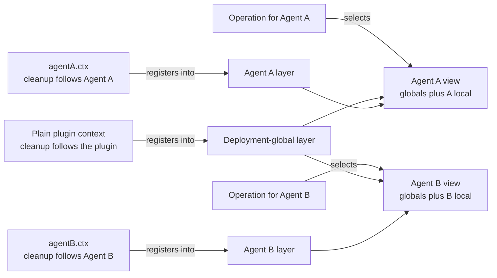
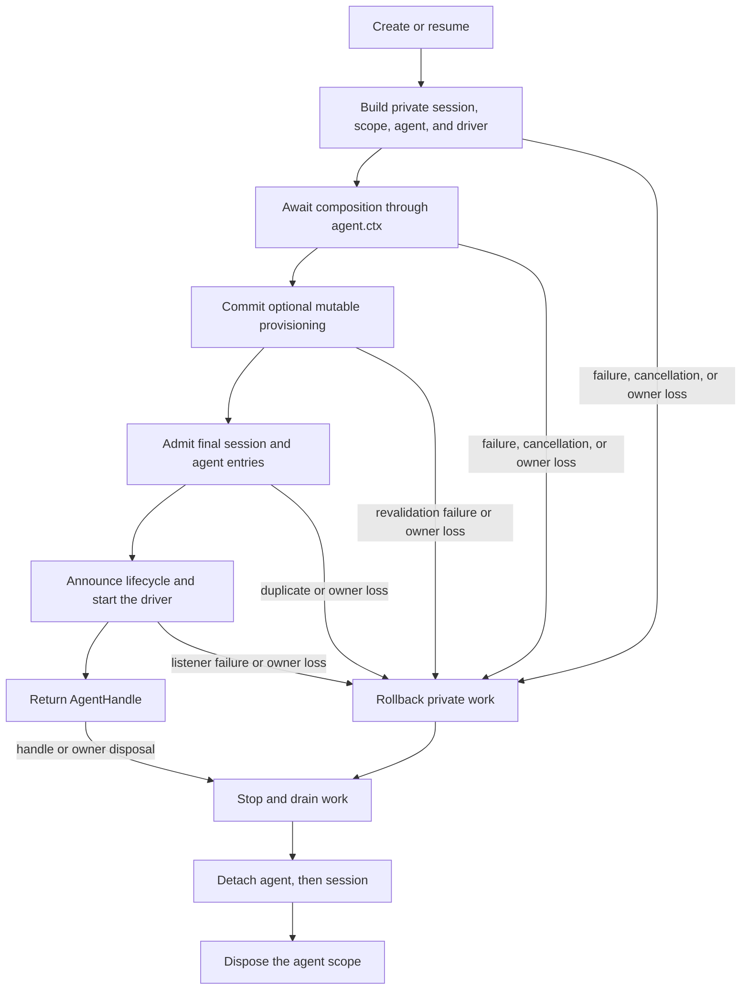

# Agent Note: The agent is a registration scope

Status: implemented

English | [中文](2026-07-08-agent-scope-contexts.zh.md)

## Problem

One application needs to share infrastructure across many agents while letting each agent have its own tools, prompt contributions, policies, and listeners. Shared adapters, persistence, and user interfaces belong to the deployment; a persona, tool variant, or listener often belongs to one agent.

A separate service graph per agent duplicates shared infrastructure. One global registration graph has the opposite failure: an agent-specific contribution can leak into unrelated agents. Contributors need one ordinary registration mechanism that determines both who can see a contribution and when it is cleaned up.

The mechanism also needs a publication boundary. An agent must not become visible before its local world is complete, and teardown must retain that world until final work has stopped.

## Decision

Every live agent owns one flat registration layer exposed as `agent.ctx`. Code registers through the context that owns a contribution; scope-aware services combine deployment-global registrations with exactly one matching agent layer; operations choose that layer from their real agent; and the layer exists for the agent's complete published lifetime.

Cordis is the plugin framework underneath the SDK. A Cordis **context** is the object plugins use to access services and register effects whose cleanup follows that context. The [Cordis primer](../../../../docs/cordis-primer.md) explains the framework in more detail.

For most contributors, the complete contract is four rules:

| Question | Rule |
|---|---|
| Where do I register behavior for one agent? | Call the ordinary registration API through `agent.ctx` |
| What does an operation for an agent see? | Deployment globals plus that agent's layer, using the owning service's merge rules |
| Which scoped listeners run? | Unscoped listeners plus listeners registered for the operation's agent |
| How long does the layer exist? | Setup completes before publication; disposal keeps it until work reaches quiescence |

The scope is flat. Resolution never walks parent or sibling scopes, and lifetime ownership does not imply registration inheritance.



The missing cross-edges are the isolation rule: Agent A's local registrations do not enter Agent B's view, and a parent's registrations do not enter a child merely because the parent owns the child's lifetime.

The companion [runtime-design Agent Note](2026-07-12-agent-scope-runtime-design.md) explains the implementation and correctness reasoning. The [subagent composition-controls Agent Note](../feature/2026-07-12-subagent-persona-tool-filter-and-depth.md) owns the separate `persona`, `toolFilter`, and `maxDepth` feature.

### Registration origin chooses visibility and cleanup

A registration made through a plain plugin context is deployment-global and is disposed with that plugin. The same method called through `agent.ctx` contributes to one agent and is disposed with that agent's scope.

| Registration origin | Default visibility | Disposed with |
|---|---|---|
| Plain plugin context | Every eligible agent view | Registering plugin |
| `agent.ctx` | Exactly that agent's view | Agent scope |

Tools, prompt sections and variables, tool restrictions, guards, and scoped event listeners adopt this contract. Named local values ordinarily shadow a same-named global value for that agent; each owning service documents exceptions and merge behavior.

The ordinary contributor pattern is to register the complete local world during agent setup:

```js
const handle = await ctx.agents.create({
  sessionId: SessionId('reviewer'),
  agentOptions: { model: 'model-name' },
  setup(agentCtx) {
    agentCtx.systemPrompt.section({
      name: 'deployment:persona',
      order: 0,
      text: 'Review code, but do not modify files.',
    })
    agentCtx.tools.register({
      name: 'review_summary',
      description: 'Return the review summary.',
      parameters: { type: 'object', properties: {} },
      async execute() {
        return [{ type: 'text', text: 'review complete' }]
      },
    })
  },
})

ctx.tools.get('review_summary')                // undefined: not global
ctx.tools.get('review_summary', handle.agent)  // the reviewer-local tool

await handle.dispose()
ctx.tools.get('review_summary', handle.agent)  // undefined: scope is gone
```

Setup receives a full trusted Cordis context so it can compose ordinary plugins and services. Its contract is composition-only: driving or publishing the in-flight agent through casts or internal registry calls is unsupported.

### The operation chooses the view

Registration origin and operation subject are separate facts. Calling a service through `agent.ctx` selects where a new registration belongs; it does not bind later reads to that agent.

Tool lookup and execution receive the agent they act for. Prompt assembly receives an assembly context for the agent whose request is being built. Event dispatch receives its domain subject. This keeps shared service instances reusable across agents while making each operation's view explicit.

Only services that adopt the scope contract resolve an agent layer. `agent.ctx` does not automatically change arbitrary Cordis service calls.

### Scoped events keep routing separate from event data

An event about Agent A normally reaches unscoped listeners and A-scoped listeners, not B-scoped listeners. An event without an agent subject reaches only unscoped listeners.

At the Cordis level, `Scoped<T>` is an opaque routing receiver. It carries the filter used to choose listeners but is not the domain object. Event signatures therefore keep the real `Agent`, tool execution, approval request, or other subject as an explicit argument that listeners can inspect.

A listener registered with `{ global: true }` deliberately bypasses contextual audience filtering while its cleanup still follows the registering context. Registry-membership notifications remain unfiltered because they describe shared registry state rather than one agent's operation. The exhaustive event reference is the set of generated `cordis-surface` regions across the [subsystem pages](../../../../docs/subsystems/core.md) — each event scope on its owning page (`agent/*` and `agent-loop/*` on core.md itself).

### Creation publishes last and disposal revokes last

`ctx.agents.create()` and `resume()` build an unpublished session, scope, agent, and driver. They await `setup`, synchronously invoke its optional `AgentSetupCommit`, admit the final session and agent entries, announce them in order, start the loop, and only then return a handle. The commit lets mutable provisioning revalidate at the exact publication boundary after every setup await; a throw rolls the private transaction back before either identity is announced, while revocation after a successful commit is ordinary live teardown.

An optional creation signal cancels work only while create or resume is pending. After the promise resolves, the returned `AgentHandle` owns explicit disposal.

If loading, setup, the optional setup commit, admission, or publication fails, the private transaction rolls back everything it prepared. Concurrent operations using the same caller-supplied live ID may both reach setup, but final registry entry admits only one; every loser rejects and cleans its private resources. Sequential reuse after awaited disposal remains valid.

`AgentHandle.dispose()` reverses the boundary. It deactivates creation or driving, waits for synchronous publication to unwind, stops and drains the driver and final session flushes, detaches the agent and session, and finally disposes the scope. Repeated or racing disposal requests join one completion promise.

The calling Cordis context and the concrete AgentLoop factory are structural co-owners. Unloading either disposes the transaction or live agent.



## Security and authority are non-goals

Agent scopes compose trusted same-process registrations. They do not sandbox plugins, define a parent-to-child authority lattice, freeze grants at creation, or guarantee that a child can do no more than its parent.

A parent may own a child whose visible tools are wider than its own because lifetime ownership does not donate or cap registrations. A plugin holding a Cordis context also runs in the same process and can call available services directly.

Deployments that need non-escalation require a separate authority representation, propagation rule, and execution check. Parent-subset grants, creation-time authorization snapshots, explicit future-grant APIs, and generic capability/output/termination tags are outside this decision.

## Alternatives considered

The rejected designs either separate visibility from cleanup, cover only one registration family, duplicate shared infrastructure, or conflate lifetime ownership with inheritance.

### Pass an agent option to every registration

An API such as `tools.register(definition, { agent })` repeats scope plumbing in every registry and permits visibility ownership to drift from cleanup ownership. Registering through `agent.ctx` makes both facts follow one Cordis effect owner.

### Filter events while keeping registries global

Listener filtering prevents the wrong hook from running but does not scope tool schemas, executable lookup, prompt sections, variables, or other registered data. Agent-local composition would still require temporary global mutation.

### Create one service graph per agent

The required view is shared deployment services plus one local registration layer. Per-agent graphs duplicate adapters and complicate shared persistence, provider registries, and application boot.

### Inherit parent registration scopes

Parentage describes lifetime and conversation lineage, not a universal merge policy. Hierarchical lookup makes unrelated services inherit accidentally and cannot define security without a separate authority model.

## Consequences

Contributors use one familiar pattern: register shared behavior through a plugin context, register local behavior through `agent.ctx`, select the real agent on operations, and dispose the returned handle. Setup and its optional publication commit are atomic from an observer's perspective, and teardown preserves local behavior until work stops.

The cost is explicit subject selection, asynchronous programmatic creation, and service-specific scope adoption. Flat registration scope is intentionally not authority, and subagent composition controls remain a separate feature rather than hidden scope semantics.
