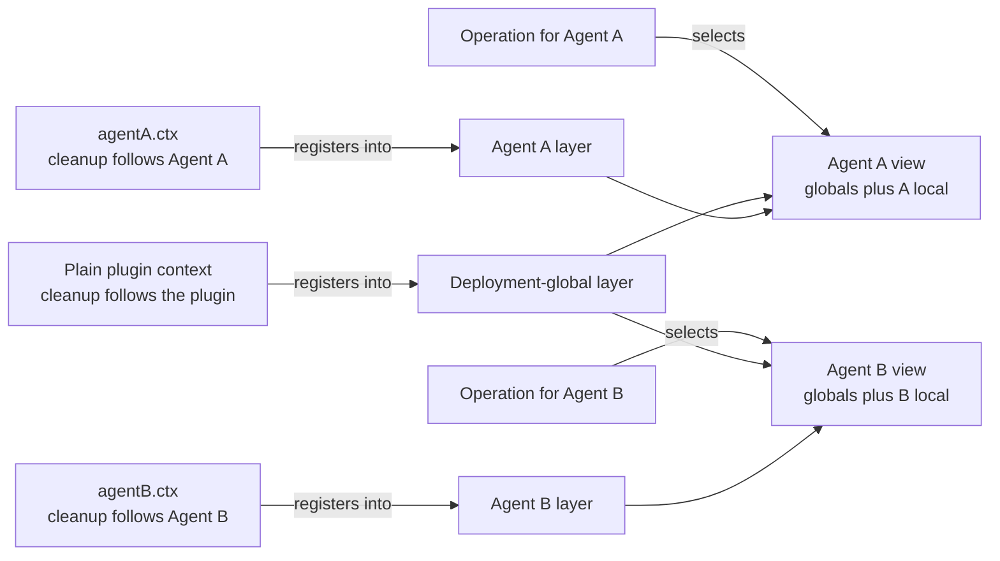
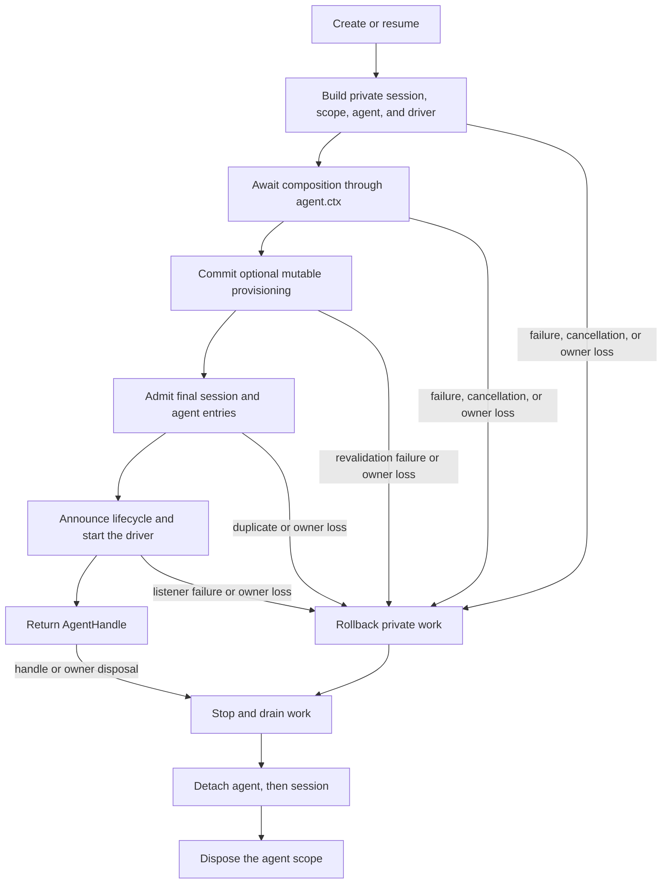

# Agent Note: agent 即注册作用域

Status: implemented

[English](2026-07-08-agent-scope-contexts.md) | 中文

## 问题

一个应用需要在多个 agent（智能体）之间共享基础设施，同时让每个 agent 拥有自己的工具、提示词贡献、策略和监听器。共享的适配器、持久化和用户界面属于部署层面；而 persona、工具变体或监听器往往只属于某一个 agent。

为每个 agent 建立独立的服务图会重复共享基础设施。使用一个全局注册图则有相反的问题：某个 agent 特有的贡献可能泄漏到无关的 agent 中。贡献者需要一种普通的注册机制，既能决定谁可以看到某项贡献，又能决定何时清理它。

该机制还需要一个发布边界。agent 在其本地世界构建完成之前不得变为可见，拆除时也必须保留该本地世界直到最终工作停止。

## 决策

每个存活的 agent 拥有一个扁平的注册层，通过 `agent.ctx` 暴露。代码通过拥有某项贡献的上下文进行注册；具备作用域感知的服务将部署全局注册与恰好一个匹配的 agent 层合并；操作从其真实 agent 选择该层；该层在 agent 的完整发布生命周期内存在。

Cordis 是 SDK 底层的插件框架。Cordis **上下文**是插件用来访问服务和注册效果的对象，效果的清理跟随该上下文。[Cordis 入门](../../../../docs/cordis-primer.md)对该框架有更详细的说明。

对大多数贡献者而言，完整约定是四条规则：

| 问题 | 规则 |
|---|---|
| 在哪里为某个 agent 注册行为？ | 通过 `agent.ctx` 调用普通注册 API |
| 某个 agent 的操作能看到什么？ | 部署全局加上该 agent 的层，按所属服务的合并规则 |
| 哪些作用域监听器会运行？ | 无作用域监听器加上为该操作所属 agent 注册的监听器 |
| 该层存在多久？ | setup 在发布前完成；dispose（资源释放）保留该层直到工作完全停稳 |

作用域是扁平的。解析永远不会遍历父级或兄弟作用域，生命周期所有权也不意味着注册继承。



缺失的交叉边即隔离规则：Agent A 的本地注册不会进入 Agent B 的视图，父级的注册也不会仅因父级拥有子级的生命周期就进入子级。

配套的[运行时设计 Agent Note](2026-07-12-agent-scope-runtime-design.md) 阐述了实现与正确性推理。[subagent 组合控制 Agent Note](../feature/2026-07-12-subagent-persona-tool-filter-and-depth.md) 负责独立的 `persona`、`toolFilter` 和 `maxDepth` 功能。

### 注册来源决定可见性与清理

通过普通插件上下文进行的注册是部署全局的，随该插件一起 dispose。同一方法通过 `agent.ctx` 调用则贡献给一个 agent，随该 agent 的作用域一起 dispose。

| 注册来源 | 默认可见性 | 随谁 dispose |
|---|---|---|
| 普通插件上下文 | 每个符合条件的 agent 视图 | 注册插件 |
| `agent.ctx` | 仅该 agent 的视图 | agent 作用域 |

工具、提示词段落与变量、工具限制、守卫以及作用域事件监听器都遵循此约定。命名的本地值通常对该 agent 遮蔽同名全局值；各所属服务文档会说明例外与合并行为。

普通贡献者的模式是在 agent setup 期间注册完整的本地世界：

```js
const handle = await ctx.agents.create({
  sessionId: SessionId('reviewer'),
  agentOptions: { model: 'model-name' },
  setup(agentCtx) {
    agentCtx.systemPrompt.section({
      name: 'deployment:persona',
      order: 0,
      text: 'Review code, but do not modify files.',
    })
    agentCtx.tools.register({
      name: 'review_summary',
      description: 'Return the review summary.',
      parameters: { type: 'object', properties: {} },
      async execute() {
        return [{ type: 'text', text: 'review complete' }]
      },
    })
  },
})

ctx.tools.get('review_summary')                // undefined: not global
ctx.tools.get('review_summary', handle.agent)  // the reviewer-local tool

await handle.dispose()
ctx.tools.get('review_summary', handle.agent)  // undefined: scope is gone
```

setup 接收一个完整的受信 Cordis 上下文，因此可以组合普通插件和服务。其约定仅限组合：不支持通过 cast 或内部注册表调用来驱动或发布正在构建中的 agent。

### 操作选择视图

注册来源与操作主体是两个独立的事实。通过 `agent.ctx` 调用服务决定的是新注册归属何处，并不将后续读取绑定到该 agent。

工具查找与执行接收其所服务的 agent。提示词组装接收正在构建请求的 agent 的组装上下文。事件分发接收其领域主体。这使共享服务实例可在多个 agent 间复用，同时让每个操作的视图保持显式。

只有采纳了作用域约定的服务才会解析 agent 层。`agent.ctx` 不会自动改变任意 Cordis 服务调用的行为。

### 作用域事件将路由与事件数据分离

关于 Agent A 的事件通常到达无作用域监听器和 A 作用域监听器，而不到达 B 作用域监听器。没有 agent 主体的事件仅到达无作用域监听器。

在 Cordis 层面，`Scoped<T>` 是一个不透明的路由接收器。它携带用于选择监听器的过滤器，但本身不是领域对象。因此事件签名将真实的 `Agent`、工具执行、审批请求或其他主体作为显式参数保留，供监听器检查。

以 `{ global: true }` 注册的监听器有意绕过上下文受众过滤，但其清理仍跟随注册上下文。注册表成员变更通知保持不过滤，因为它们描述的是共享注册表状态而非某个 agent 的操作。详尽的事件参考是各[子系统页面](../../../../docs/subsystems/core.md)上生成的 `cordis-surface` 区块的集合——每个事件作用域在其所属页面上（`agent/*` 与 `agent-loop/*` 在 core.md 本页）。

### 创建最后发布，dispose 最后撤销

`ctx.agents.create()` 和 `resume()` 构建未发布的会话、作用域、agent 和驱动器。它们等待 `setup`，同步调用其可选的 `AgentSetupCommit`，准入最终的会话和 agent 条目，按序公告，启动循环，然后才返回 handle。该提交操作让可变的配置状态在所有 setup 的 await 均结算后，于确切的发布边界重新校验；若其抛出异常，则会在公告任何一个身份前回滚私有事务，而成功提交后的撤销属于普通的存活期拆除。

可选的创建信号仅在创建或恢复挂起期间取消工作。promise resolve 后，返回的 `AgentHandle` 拥有显式 dispose 权。

如果加载、setup、可选的 setup 提交、准入或发布失败，私有事务回滚其准备的一切。使用同一个调用方提供的存活 ID 的并发操作可能都到达 setup，但最终注册表条目只准入一个；每个失败者拒绝并清理其私有资源。在等待 dispose 完成后的顺序复用仍然有效。

`AgentHandle.dispose()` 反转边界。它停用创建或驱动，等待同步发布完成退栈，停止并排空驱动器和最终会话刷写，分离 agent 和会话，最后 dispose 作用域。重复或竞争的 dispose 请求合并为一个完成 promise。

调用方的 Cordis 上下文和具体的 AgentLoop 工厂是结构性共同所有者。卸载任一方都会 dispose 事务或存活 agent。



## 安全与权限是非目标

agent 作用域组合的是受信的同进程注册。它不沙箱化插件、不定义父到子的权限格、不在创建时冻结授权、也不保证子级不能做超出父级的事。

父级可以拥有一个可见工具比自身更广的子级，因为生命周期所有权不赠予也不限制注册。持有 Cordis 上下文的插件同样运行在同一进程中，可以直接调用可用服务。

需要非升权保证的部署需要独立的权限表示、传播规则和执行检查。父级子集授权、创建时授权快照、显式未来授权 API，以及通用的能力/输出/终止标签均不在本决策范围内。

## 曾考虑的替代方案

被否决的设计要么将可见性与清理分离，要么只覆盖一类注册，要么重复共享基础设施，要么将生命周期所有权与继承混为一谈。

### 向每个注册传递 agent 选项

类似 `tools.register(definition, { agent })` 的 API 在每个注册表中重复作用域传递逻辑，且允许可见性所有权与清理所有权漂移。通过 `agent.ctx` 注册使两个事实跟随同一个 Cordis effect owner。

### 过滤事件但保持注册表全局

监听器过滤可以阻止错误的钩子运行，但无法限定工具 schema、可执行查找、提示词段落、变量或其他已注册数据的作用域。agent 本地组合仍需临时的全局变更。

### 为每个 agent 创建独立的服务图

所需的视图是共享部署服务加上一个本地注册层。每个 agent 一个服务图会重复适配器，并使共享持久化、提供方注册表和应用启动复杂化。

### 继承父级注册作用域

父子关系描述的是生命周期和对话谱系，而非通用合并策略。层级查找会让无关服务意外继承，且在没有独立权限模型的情况下无法定义安全性。

## 后果

贡献者使用一种熟悉的模式：通过插件上下文注册共享行为，通过 `agent.ctx` 注册本地行为，在操作中选择真实 agent，dispose 返回的 handle。从观察者角度看，setup 及其可选的发布提交是原子的，拆除则保留本地行为直到工作停止。

代价是显式的主体选择、异步的编程式创建，以及服务需要逐个采纳作用域。扁平注册作用域有意不等同于权限，subagent 组合控制作为独立功能存在，而非隐藏的作用域语义。
