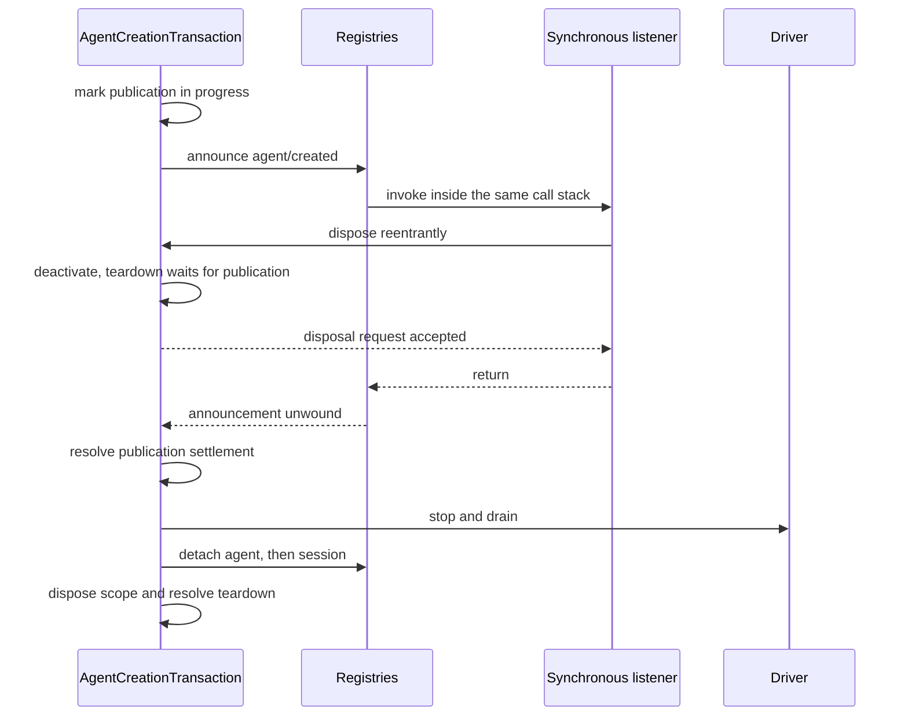

# Agent Note: Agent-scope runtime design and correctness

Status: implemented

English | [中文](2026-07-12-agent-scope-runtime-design.zh.md)

## Problem

The [agent-scope contract](2026-07-08-agent-scope-contexts.md) is simple for contributors: register through `agent.ctx`, resolve one global-plus-agent view, publish only after setup, and retain the scope until work stops. The runtime must preserve that contract across a cooperative plugin framework, asynchronous creation, reentrant listeners, durable session commits, and worker or process failure.

The main design risk is adding a second mechanism for every race. Separate reservations, readiness sentinels, cancellation relays, snapshot layers, and protection registries can mirror the same fact until no reader can tell which one is authoritative. That machinery also encourages the runtime to treat trusted typed calls as hostile serialization boundaries.

The implementation needs enough state to preserve real ownership and settlement boundaries, but no more. A correctness reviewer must be able to follow one fact from acceptance through publication and teardown without reconciling parallel representations.

## Decision

The runtime uses one mechanism per independent fact. Scope routing has an opaque carrier and shared layer store; each live registry object has one entry record; each create or resume operation has one transaction; typed same-process calls borrow readonly values; real data boundaries materialize once; the cooperative prompt-assembly result is authoritative; and worker/process code retains separate terminal and quiescence state only where different owners can genuinely race.

The design can be skimmed as seven choices:

| Problem | Authoritative mechanism |
|---|---|
| Select global plus one agent's registrations | Opaque scope key, routing carrier, and shared layer store |
| Own one live agent or session | One registry entry captured by its disposer |
| Coordinate create/resume | One `AgentCreationTransaction` |
| Protect durable, queued, model, or wire data | Materialize once at that boundary |
| Pass typed values inside one process | Readonly borrowed contract |
| Compose the model-visible prompt and tool set | One shared tool view plus the authoritative assembly-waterfall result |
| Coordinate subagent, worker, and process shutdown | One cancellation signal plus the independent terminal/quiescence facts of that boundary |

The rest of this Agent Note expands those choices in dependency order: Cordis mechanics, scope routing, creation and session commit, tools and prompts, subagents and workflows, then executable checks.

The [July 8 Agent Note](2026-07-08-agent-scope-contexts.md) remains the contributor contract. The separate [subagent composition-controls Agent Note](../feature/2026-07-12-subagent-persona-tool-filter-and-depth.md) owns `persona`, `toolFilter`, and `maxDepth`; this document discusses only how their setup fits the lifecycle.

## Cordis model: context, fiber, effect, receiver, and waterfall

Five Cordis ideas are required to understand the implementation. A context selects services and registration ownership; a fiber is one live plugin or child lifecycle; an effect attaches cleanup to a fiber; an event receiver selects listeners; and a waterfall lets listeners transform or short-circuit an operation in sequence.

### A context is an ownership path through one service graph

All agents share one Cordis service graph. A derived context does not clone `ToolRuntime`, `SystemPrompt`, persistence, or model adapters; it changes how registrations made through that context are tagged and which effects own their cleanup.

`agent.ctx` is such a derived context. Service calls still reach the shared instances, while a registration can inspect its calling context and store a contribution under the nearest scope key. Ordinary plugin contexts carry no scope key and therefore register globally.

### Fibers and effects make cleanup structural

A Cordis fiber is the live instance created when a plugin or child context is activated. Its state records whether that lifecycle is active, unloading, failed, or disposed. `ctx.effect()` and `ctx.on()` return disposers and also attach those disposers to the registering fiber, so unloading a plugin or agent scope removes everything registered through that context without a separate inventory.

The vendored Cordis fiber implementation establishes ownership before arbitrary setup or `internal/plugin` observers run. A reentrant unload can see the child fiber or effect that has started, reject effects added after unload begins, and join cleanup already started through a public single-shot disposer. Teardown observers are contained individually so one callback cannot prevent structural cleanup.

These are framework lifecycle guarantees rather than agent-specific policy. Agent creation depends on them because setup can activate arbitrary plugins and synchronously reenter owner disposal.

### Receivers route listeners; waterfalls compose decisions

Cordis filters listeners using the dispatch receiver (`this`), while harness listeners need an explicit agent, execution, request, or other subject. `Scoped<T>` marks the receiver expected by a scoped event declaration, but the runtime carrier deliberately exposes no subject API.

Product helpers therefore construct the carrier and pass the domain subject separately. This prevents listener routing from becoming an alternate object model and keeps event signatures understandable without knowledge of carrier internals.

A Cordis waterfall is middleware-style dispatch. Each listener receives `next()`: calling it delegates to the remaining listeners and base operation, while returning without it short-circuits or replaces the downstream result. Waterfalls power prompt assembly and tool policy; ordinary emit events notify synchronously, and parallel events await all listeners without a veto result.

## Scope routing: one opaque key selects one layer

The scope package implements the smallest object needed for Cordis routing. Its carrier holds only a composed service filter and scope predicate, while the package records the opaque key privately and exposes the scope fiber's quiescent disposer separately.

### Scope identity uses object identity

A `ScopeKey` is an opaque object compared by identity. The harness uses the live `Agent` as its own key, but the primitive is domain-neutral and supports other scoped owners.

`createScope(parent, key)` returns a scope whose `ctx` shares the parent's services and whose effects are tagged with that key. `scopeOf(ctx)` reads the nearest registration key. `scopeTarget(base, key)` creates the event receiver whose filter preserves the base receiver's Cordis service filter, then admits unscoped listeners and listeners with that exact key.

The receiver is a small carrier rather than a transparent proxy for the domain object. Code that needs the agent receives the explicit event argument; code that needs registration ownership receives `agent.ctx`.

### Registry reads overlay one exact layer

Scope-aware registries use `ScopedLayers` to own one eager global aggregate and lazily created identity-keyed aggregates. A read resolves the global layer and at most one exact local layer; it never creates state or traverses parentage. Registration visibility and Cordis effect ownership derive from the same context, and reclamation waits until the concrete layer's complete aggregate is empty ([decision](2026-07-12-scoped-layers-store.md)).

Each service retains its domain rule. Named command and prompt views use the shared insertion-ordered shadow merge; tools keep a richer resolver because restrictions filter globals before local tools are added and the reserved Code Mode transport is inserted separately. Prompt variables and tool guards retain live iteration, while tool-provider membership is materialized per assembly. Scope supplies storage lifecycle and named shadowing, not a universal registry view.

### Fused dispatch helpers prevent subject drift

`agentEvents(context, agent)` constructs the agent's carrier and injects the same agent as the event subject. Session, tool, approval, prompt, and subagent services likewise derive routing from the object they already own instead of accepting an unrelated key.

The type marker rejects ordinary bare-receiver mistakes, and development invariants cover direct JavaScript or casted dispatch. The subject remains explicit because routing correctness and useful event data are different concerns.

## Agent creation: one transaction owns the complete operation

Create and resume are one asynchronous lifecycle with several phases, not several lifecycles. `AgentCreationTransaction` owns caller and factory liveness, optional cancellation, private resources, publication, rollback, and the memoized teardown observed by every owner.

### Registry entries are the only live identity records

AgentRegistry and SessionStore each keep one entry per live object. The entry holds the stable ID, object, scoped carrier, and the small amount of publication or append state that belongs to that object.

A detach closure captures its exact entry. It deletes only when the map still points to that entry, so an old disposer cannot delete a later object that reuses the same ID. No registry rereads a mutable caller object to decide identity.

There is no reservation API. Caller-supplied IDs are admitted at final entry. Concurrent same-ID operations may both complete private setup; exactly one final `enter()` succeeds, and every loser rolls its private resources back. Sequential reuse is valid after the earlier disposer reaches quiescence.

### The transaction owns preparation before awaiting it

The transaction is installed under both the calling Cordis context and the concrete AgentLoop factory before persistence load or setup can suspend. It also observes an optional create/resume signal until the public operation settles.

Create prepares a new Session. Resume loads and validates the persisted Session before preparing the same live session identity. Both paths then build the scope, agent, and driver and invoke the same setup/publication algorithm.

The factory stores concrete trace targets but invokes them through a caller-bound Cordis trace. This preserves dependency origin and caller ownership without stacking trace proxies.

### Setup is trusted composition inside a private world

Setup receives the full child context and may await plugin activation. It can register tools, prompt sections, restrictions, listeners, and other effects, but the public contract does not support driving or publishing the in-flight agent through casts or internal registry calls.

The transaction races asynchronous load and setup against deactivation rather than waiting forever for a promise owned by external code. If cancellation or owner unload wins, public creation rejects after transaction-owned cleanup even when the external promise never settles.

### Publication has one ordered commit path

Publication admits and announces resources in the order required by observers:

1. Enter the session.
2. Enter the agent.
3. Announce `session/created`.
4. Announce `agent/created`.
5. Enable public driving.
6. Emit `agent/session-start`.
7. Start the driver.

The agent never drives before both registries and creation notifications agree. A synchronous listener may veto or dispose an owner; the transaction records publication in progress and waits for that callback stack to unwind before teardown continues. Every creation announcement that begins has a matching disposal announcement during rollback.

The sequence diagram isolates the non-obvious race: a synchronous creation listener can request disposal while the publication call stack still owns both registry entries. Teardown must deactivate immediately but wait for that stack to unwind before stopping and detaching anything.

### Teardown preserves work before revoking registrations

Every teardown request joins one memoized path. The order is:

1. Deactivate creation or driving and let synchronous publication finish.
2. Stop and drain the driver, discarding any injection that remains pending.
3. Detach the agent.
4. Detach the session.
5. Dispose the agent scope.
6. Retire transaction ownership tracking.

This order lets final agent and session events use the matching scoped listeners and keeps persistence observers attached through the final flush. Scope disposal comes last because registration revocation is the externally visible lifetime boundary.

## Session append: materialize, validate, commit, notify

Session events cross a durable boundary, so append owns their data. The rest of the algorithm uses one attached entry and one commit point.

### Durable data is materialized once

Session headers, seeds, and appended events are lossless JSON data. The Session constructor or append path materializes and validates them before storage and exposes frozen snapshots, so later caller mutation cannot change persistence, replay, or model reconstruction.

This is a real ownership boundary: the values leave the caller, may be persisted, and must reconstruct the same request later. It is intentionally stricter than a typed same-process callback or registry definition.

### Pre-commit listeners can veto; post-commit observers cannot

Append follows one sequence:

1. Materialize the durable event and surface intent.
2. Claim the SessionEntry and reject reentrant append on that entry.
3. Resolve scoped callbacks and run internal invariant validation.
4. Push exactly once; this is the commit point.
5. Notify each observer independently, containing synchronous and asynchronous failures.
6. Release append state and honor a detach requested during publication.

No observer error makes a committed event look uncommitted, and one bad listener cannot starve later listeners. Session invariants stage their transition before commit and apply it only when the same event reaches the contained post-commit observer.

`flush()` starts every persistence listener and awaits every result before reporting failure. This deliberate all-settled behavior prevents a synchronous failure from starving another backend or final flush.

## Trust boundaries: copy only when ownership actually changes

The runtime distinguishes typed in-process contracts from serialization and durability boundaries. This is the main simplification rule for values and callbacks.

| Boundary | Ownership rule |
|---|---|
| Typed service/plugin call in the same process | Borrow readonly values and callbacks |
| Parsed plugin configuration or external file | Validate semantic and structural input |
| Queued inbox message | Materialize before asynchronous consumption |
| Model/tool JSON input or output | Materialize at the model/tool boundary |
| Durable session or persistence data | Materialize and validate before commit |
| Worker, process, or wire message | Serialize, validate, and own the decoded value |

Tests that fabricate hostile getters, replace typed callbacks after handoff, or cast fake service objects do not define a production contract by themselves. The runtime keeps checks where data crosses a parser, queue, model, durable, file, worker, process, or wire boundary and relies on readonly types plus plugin discipline inside the trusted process.

Callback containment is separate from data ownership. Listeners are arbitrary extension code and can throw even when their arguments are trusted; publication and post-commit paths still contain failures according to their event contract.

## Tools and prompts: one view, authoritative assembly, committed outcomes

Tool presentation and execution share one private resolver. Prompt assembly remains trusted cooperative composition: registries supply the ordered input, and the assembly waterfall's returned value is exactly what the loop logs and sends. Execution uses separate one-way boundaries only where policy or outcome settlement must be monotonic.

### One resolver defines the tool view

The private resolver applies the current presentation mode, live global restrictions, exact local overlay, and local shadowing. Schemas, lookup, execution, Code Mode SDK generation, and restriction validation all use that resolver or its pre-restriction global-name view.

The [subagent composition-controls Agent Note](../feature/2026-07-12-subagent-persona-tool-filter-and-depth.md#tool-filtering-is-one-live-global-view-rule) owns the user-visible allow/deny semantics. The implementation requirement is agreement: a filtered-away global cannot remain executable through a different lookup path, and a locally shadowed definition is the same definition presented and executed.

`ToolRestriction` accepts readonly allow/deny names and compiles them into internal sets. Multiple restrictions intersect. Public `visible()` and `knownNames()` methods are unnecessary because only the registry needs the intermediate views.

### Tool execution owns identity and boundary materialization

The registry assigns every execution a fresh branded `Symbol` token. Nested Code Mode calls carry the outer token as `parent`, so structured output can correlate an inner capture with its enclosing `run_code` result by identity.

A fresh registry-assigned Symbol provides collision-free execution identity without a WeakSet membership registry. Callers cannot supply the execution's own token through `ToolExecutionInput`; they only receive the pipeline-owned `ToolExecution` after the registry creates it. This is a trusted typed contract, not a runtime defense against arbitrary casts or JavaScript callers.

Arguments are materialized once where model/tool JSON enters the pipeline. Pre-, around-, and post-execute listeners operate on the typed execution and decisions. Call ID correlation, approval, monotonic guards, and Code Mode nesting remain explicit relational checks.

After post-execute or outer pipeline normalization, the registry losslessly snapshots the candidate result, converting a snapshot failure into an ordinary error, invokes the call's snapshotted optional `ToolDefinition.finalizeContent` callback, then materializes and freezes the accepted final result once. The callback may replace only content, so structured error identity, contexts, and metadata remain registry-owned even when a tool enforces a last-mile result bound. Every synchronous `tools/result` observer receives that exact committed object, and observer failures are contained individually. An outer pipeline or candidate-snapshot failure is normalized before final content, so observers can discard staged work against the same authoritative boundary.

### The assembly waterfall owns the final model-visible composition

SystemPrompt first resolves the global-plus-agent sections, variables, and tool providers into a deterministic registry contribution. The scope-filtered `system-prompt/assemble` waterfall may then reorder, replace, add, or remove any section, variable, or schema. Its returned assembly is authoritative; there is no later restoration pass and no finality metadata on ordinary prompt sections, tool definitions, or provider results.

This is a trusted same-process extension point, not an authority boundary. A listener that changes Code Mode's `run_code` schema or `tools:sdk` instructions, or a structured child's capture schema or instruction, owns preserving a coherent protocol in the assembly it returns. ToolRuntime still reserves `run_code` against ordinary tool registration and restriction because those are registry invariants, but assembly middleware remains free to transform the final model-visible surface.

Scope solves the real isolation problem directly. Structured-output contributions register in the child's exact scope, while Code Mode derives its transport and SDK from the same resolved tool view. A second named-protection system would need another ownership and collision rule across arbitrary schema providers—including providers that intentionally contribute duplicate names—without creating a new trust boundary.

### Structured output commits only authoritative outcomes

Structured output combines child-scoped composition with a two-phase execution commit. The child registers its `structured_output` tool and instruction before publication; a trusted assembly listener may transform those ordinary contributions and is responsible for preserving the protocol if the child is expected to complete. The tool body validates a candidate and stages it by the current `ToolExecution`, but successful capture is decided only by immutable `tools/result` observations.

For a native call, the observer deletes the stage and commits its value only when that exact execution's final result succeeds. A post-execute block or outer pipeline failure therefore cannot leave a captured value behind.

For a Code Mode SDK call, the inner successful result records `{ parentToken, value }` rather than committing. The observer waits for the `run_code` execution whose token matches `parentToken` and commits only if that outer final result also succeeds. Program failure, runtime abort, or outer post-policy denial discards the pending value.

Once a value is pending or committed, a scoped monotonic guard denies later tool calls. The successful structured-output execution calls `exec.concludeTurn()`, so its own immutable result carries `concludesTurn: true` and the loop ends the tool loop at that step. A schema-validation failure remains an ordinary `INVALID_ARGS` tool error and leaves the child able to retry within the same turn.

Pure Code Mode's registry contribution omits `structured_output` from native wire schemas and exposes it through the generated SDK. The assembly waterfall may deliberately change that presentation; execution still validates against the child-scoped definition, and the listener owns the consistency of any alternate model-visible route it creates.

### Three execution boundaries are deliberately one-way

Prompt assembly is intentionally cooperative, but three execution facts need one-way settlement after their extensible stages:

| Boundary | Final power | Why ordinary listener order is insufficient |
|---|---|---|
| Tool pre-policy | Deny monotonically | A later listener must not re-allow an already denied call |
| Tool result | Observe the immutable committed outcome | Structured output must commit only the result that actually escaped the pipeline |
| Turn continuation | Conclude through the committed tool result | A committed terminal output must end the turn |

`ToolGuard` is the monotonic policy registry. Committed tool observation is the contained `tools/result` point described above. Terminal structured output marks its own execution with `concludesTurn`, so terminality is data on the authoritative result rather than a separate hook decision.

### Skill and approval services trust typed callers

Skill registry definitions and approval policies are readonly same-process contracts. Their services do not clone callback objects or defend against post-handoff callback replacement.

Skill still validates external skill files and parsed provider output, routes catalogs through the calling agent's tool view, and disposes registrations exactly. Approval still resolves policy, observes cancellation, routes `approval/request` by `request.agent`, records the durable audit pair, and contains answerer and post-commit observer failures.

## Subagents: publication is the start promise

Subagent startup has one ownership transfer. The provider owns unpublished resources until its start promise fulfills with a published run; the caller owns the returned run and must dispose it.

### The service contract has one cancellation channel

`SubagentProvider.start()` and `SubagentRuntime.start()` return `Promise<SubagentRun>`. The promise fulfills after the backend crosses its publication boundary, so callers and `subagent/start` observers never need a second `run.started` promise. Provider work that fails before publication rejects `start()`; prompt, turn, cancellation, and infrastructure outcomes after publication settle through `SubagentRun.result` without hiding the child id, as required by the [durable catalog decision](../feature/2026-07-22-durable-subagent-catalog-and-list-agents.md).

`SubagentStartRequest.signal` is required. Aborting it requests cancellation during startup and across the published run's remaining readiness or turn work. `SubagentRun.dispose()` also requests cancellation and awaits quiescence. There is no separate public `run.cancel()` channel.

Continuable conversations use their separate creation and follow-up operations and have no `SubagentRun`; their manager owns each resident `AgentHandle`.

The service validates provider capabilities and request semantics before calling the provider. A provider rejection cleans unpublished resources before the rejection escapes and emits no `subagent/start`/`subagent/end` pair. After fulfillment, the service attaches result observation, emits scoped start, and returns the run; a post-publication result rejection closes that pair. Provider removal prevents later starts but does not revoke a run already accepted by the provider.

### In-process providers reuse the core transaction

Spawn and fork share one in-process driver. It creates the child through `parent.ctx`, passes the required signal into the core creation transaction, and installs persona, tool restriction, and structured-output contributions during unpublished setup.

The provider awaits creation and returns only the published run. At the handoff, core creation detaches its creation-only abort listener; the provider immediately rechecks the signal before installing the live-run listener, so an abort in that narrow interval disposes the new handle instead of escaping cancellation. Parent teardown follows the child because the operation belongs to `parent.ctx`; provider unload blocks new starts but does not become a second revocation owner for accepted runs. The run disposer cancels the child and awaits the AgentHandle's ordered teardown.

Spawn uses an empty session seed. Fork uses a validated completed-turn prefix. Conversation seeding changes history only and does not import scope, tools, services, or authority.

### ACP providers own the process until readiness or cleanup

An ACP provider crosses a real process and wire boundary, so it retains validation, environment scrubbing, message serialization, abort/process races, and kill-to-exit quiescence.

Start resolves only after `initialize` and `newSession` succeed. Abort, spawn failure, RPC failure, or invalid startup response reaps the process before rejection. After readiness, result maps the ACP prompt outcome and streamed output; dispose requests cancellation, closes the connection, and awaits process exit through one memoized path.

## Workflows and ACP processes: retain only independent async facts

Worker and child-process bridges need more state than same-process registries because messages, process death, and cleanup can settle independently. Their state is organized around those real facts rather than duplicate cancellation protocols.

### Workflow children are pending starts or published records

The workflow host keeps pending provider-start promises and published child records. A child moves from pending to published only when async `SubagentRuntime.start()` fulfills; rejected starts clean their partial provider work and produce no child lifecycle pair.

One host-owned AbortController supplies the required signal to pending and live children. Closing workflow admission aborts that signal, so there is no duplicate `ChildCancel` worker RPC or explicit host-side `run.cancel()` fanout. Quiescence waits for both pending starts and published child disposal.

The worker boundary still serializes requests and outcomes. The host retains first-terminal-outcome arbitration, exact child accounting, worker-death handling, grace termination, late/duplicate message rejection, and bounded cleanup because result receipt, worker exit, and child quiescence are genuinely independent facts.

### Terminal result and physical cleanup remain separate

The workflow result records the first accepted terminal outcome according to the public precedence rules. Cleanup can continue after that result is chosen: live children still need disposal, a worker still needs termination, and a slow external backend may outlive the configured grace bound.

Public disposal claims its memoized promise before invoking callbacks. Worker death closes admission before processing any queued late child request, synthesizes missing lifecycle ends, and starts child/process cleanup without rewriting an outcome already claimed.

### ACP prompt settlement does not depend on update delivery

The [automation-only ACP bridge](../simplification/2026-07-23-acp-automation-only-protocol.md) correlates one in-flight prompt with its observed user-message turn directly. It does not scan from a log watermark or use session status as a second reconciliation oracle.

The session-event listener settles correlation from the matching `turn/end` even when a committed-message update cannot reach the client. Update delivery therefore cannot leave the session permanently in flight. ACP creates server-assigned fresh session ids and owns every resulting agent handle until connection teardown.

## Correctness enforcement

The design is enforced at types, runtime escape points, generated contracts, and behavioral tests. No one layer is asked to prove what it cannot observe.

### Types make the ordinary path hard to misuse

Readonly contracts describe borrowed same-process values. `Scoped<T>` marks event receivers, `agentEvents()` fuses carrier and subject, tool inputs omit registry-owned tokens, and subagent async return types expose publication and settlement directly.

TypeScript cannot govern JavaScript casts, direct Cordis dispatch, process messages, or durable files, so runtime enforcement remains at those escape points.

### Runtime invariants cover cross-service facts

The `dsh-scope/invariant` companion verifies, when selected, that every declared scoped event uses a marked carrier and that event families exposing a subject use the matching key. The separate `dsh-session/invariant` contribution stages trace validation before append commit and advances after the same event commits; both register through `ctx.invariants`.

The plugin does not police trusted setup by scanning registries or reject prompt assembly objects fabricated through casts. Those checks would turn composition contracts into speculative runtime machinery without protecting a real external boundary.

### Generated artifacts keep public contracts aligned

The event catalog, service catalog, producer/consumer matrix, configuration catalog, module graph, tool catalog, type-equivalence blocks, and scoped-event resolver map are generated or freshness-gated from source. The [TypeScript semantic-gates Agent Note](../process/2026-07-14-typescript-program-backed-semantic-gates.md) owns Program construction, semantic event discovery, and resolver-generation rules.

Behavioral tests pin scoped routing and disposal, final-entry collision cleanup, publication rollback, ordered quiescence, durable pre/post-commit behavior, live tool filtering across presentation and execution, cooperative prompt assembly, structured-output commit in native and Code Mode, async subagent startup and signal cancellation, worker terminal arbitration, ACP settlement, and process teardown.

## Alternatives considered

The [July 8 Agent Note](2026-07-08-agent-scope-contexts.md#alternatives-considered) owns alternatives to the public flat-scope contract. The alternatives here concern implementation shape.

### Use a transparent proxy as the scope carrier

A proxy that impersonates the subject must preserve property, callable, constructable, private-field, descriptor, and proxy-invariant behavior that listener routing never needs. A small opaque carrier keeps the filter and key while the explicit event argument carries the subject.

### Reserve agent and session IDs before setup

Reservations prevent duplicate private setup work but require cross-service capabilities, release ordering, abandoned-reservation cleanup, and prepared-object binding. IDs are caller-supplied and concurrent reuse is caller error; final entry can choose the winner while the losing transaction rolls back cleanly.

### Snapshot every typed same-process argument

Universal copying defends against stateful getters and callers that violate readonly contracts, but it adds allocation, duplicated validators, and paths that can forget to copy. Materialization belongs at parser, queue, model, durable, worker, process, and wire boundaries where ownership actually changes.

### Give readiness, cancellation, and disposal separate controllers

Parallel sentinels can all mirror whether one operation is live. One transaction or start promise owns the operation; separate promises remain only where publication unwind, external work, terminal result, and physical quiescence can settle independently.

### Keep synchronous subagent start plus `run.started`

This splits provider acceptance from publication and forces every consumer to register a partial run, attach result observation, await publication, and clean up publication failure. An async start promise keeps provider-to-caller ownership transfer at publication; the existing result promise owns any remaining readiness instead of adding another lifecycle promise.

### Restore selected prompt or tool contributions after assembly

A post-waterfall restoration pass would create a second composition rule after the documented cooperative waterfall. Correctly assigning canonical presence or absence would also require provider ownership and collision rules for arbitrary tool-schema providers, whose ordinary output may contain duplicate names. Scoped registration already supplies the required per-agent isolation, and trusted assembly listeners own the protocol consistency of what they return, so named restoration adds machinery without establishing an independent boundary.

### Remove worker/process lifecycle guards with same-process hardening

Worker messages, process death, and durable input do cross ownership and serialization boundaries. First-outcome arbitration, validation, environment scrubbing, and quiescent process cleanup remain necessary even though hostile same-process callback machinery does not.

## Consequences

The implementation is smaller and its proof follows the same shape as its ownership graph. One key selects a layer, one entry owns a live registry object, one transaction owns creation, one resolver owns a tool view, and one async promise transfers subagent ownership.

### What the design guarantees

- A scoped contribution is visible only in its exact agent view and is disposed with that scope.
- Create and resume expose no partially configured handle; final-entry losers and publication failures clean every prepared resource.
- Disposal retains scoped listeners and persistence through driver drain and final session work, then revokes the scope.
- Durable, queued, model, worker, process, and wire values are owned at their real boundary; typed same-process values follow readonly contracts.
- ToolRuntime's presentation, lookup, and execution resolve the same live view before expert assembly transforms, and committed results have one immutable observation point.
- Registry contributions are deterministic inputs, while the trusted assembly waterfall owns the final model-visible composition.
- Subagent start returns only a published run, required signals cancel pending or live work, and disposal reaches the backend's quiescence contract.
- Worker/process result precedence and cleanup remain correct under death, late messages, and bounded teardown.

### Costs and limits

Scope-aware services still maintain global and identity-keyed maps, and operations must carry their real agent explicitly. Async create/resume and subagent start require callers to await ownership transfer and dispose returned handles.

A trusted `system-prompt/assemble` listener can remove or replace Code Mode and structured-output protocol pieces. This is deliberate: the listener owns final composition and must preserve any protocol the deployment expects to remain usable.

The design trusts typed plugins in the same process. It does not defend against arbitrary casts, stateful getters, mutation that violates readonly contracts, or a plugin deliberately using ambient service access outside the supported composition API.

The [security and authority non-goal](2026-07-08-agent-scope-contexts.md#security-and-authority-are-non-goals) remains fundamental. These mechanisms prove registration composition, publication, and lifetime ownership; they do not prove confinement or parent-to-child non-escalation.
