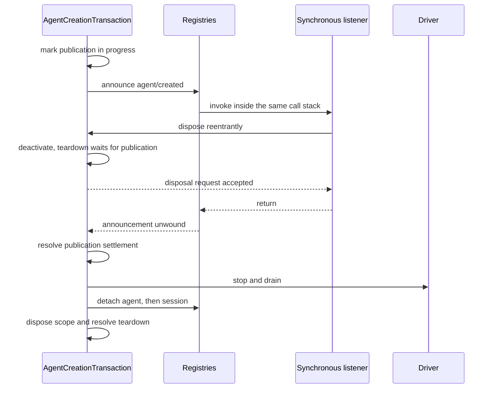

# Agent Note: Agent 作用域运行时设计与正确性

Status: implemented

[English](2026-07-12-agent-scope-runtime-design.md) | 中文

## 问题

[agent（智能体）作用域约定](2026-07-08-agent-scope-contexts.md)对贡献者而言很简单：通过 `agent.ctx` 注册，解析出一个全局加单 agent 的视图，仅在 setup 完成后发布，并保持作用域直到工作停止。运行时必须在协作式插件框架、异步创建、可重入监听器、持久化会话提交以及 worker 或进程故障等场景下维护这份约定。

主要的设计风险是为每个竞态条件引入第二套机制。独立的预留、就绪哨兵、取消中继、快照层和保护注册表可能镜像同一个事实，直到没有读者能分辨哪个才是权威的。这些机制还会诱使运行时把可信的类型化调用当作敌对的序列化边界来处理。

实现需要足够的状态来维护真实的所有权和结算边界，但不能更多。正确性审查者必须能够从接受、发布到拆除，沿着一条事实链跟踪下去，而无需在并行的表示之间做调和。

## 决策

运行时对每个独立事实使用一种机制。作用域路由有一个不透明载体与共享 layer store；每个活跃的注册表对象有一条注册表条目；每个创建或恢复操作有一个事务；类型化的同进程调用借用 readonly 值；真实数据边界只物化一次；协作式提示词组装的结果即为权威；worker/进程代码仅在不同所有者确实可能竞争时才保留独立的终止态和完全停稳态。

该设计可概括为七项选择：

| 问题 | 权威机制 |
|---|---|
| 选择全局加某个 agent 的注册 | 不透明作用域键、路由载体与共享 layer store |
| 拥有一个活跃的 agent 或会话 | 由其 disposer 捕获的单条注册表条目 |
| 协调创建/恢复 | 单个 `AgentCreationTransaction` |
| 保护持久化、队列、模型或协议格式数据 | 在该边界处一次性物化 |
| 在同一进程内传递类型化值 | Readonly 借用约定 |
| 组合模型可见的提示词与工具集 | 单个共享工具视图加权威的 assembly-waterfall（瀑布式事件）结果 |
| 协调 subagent、worker 和进程关闭 | 单个取消信号加该边界独立的终止态/完全停稳态事实 |

本 Agent Note 余下部分按依赖顺序展开这些选择：Cordis 机制、作用域路由、创建与会话提交、工具与提示词、subagent 与工作流，最后是可执行检查。

[7 月 8 日 Agent Note](2026-07-08-agent-scope-contexts.md) 仍然是贡献者约定。独立的 [subagent 组合控制 Agent Note](../feature/2026-07-12-subagent-persona-tool-filter-and-depth.md) 拥有 `persona`、`toolFilter` 和 `maxDepth`；本文仅讨论它们的 setup 如何融入生命周期。

## Cordis 模型：上下文、fiber、effect、receiver 与 waterfall

理解实现需要五个 Cordis 概念。上下文选择服务和注册所有权；fiber 是一个活跃的插件或子生命周期；effect 将清理逻辑附加到 fiber；事件接收器选择监听器；waterfall 让监听器按顺序变换或短路一个操作。

### 上下文是贯穿单个服务图的所有权路径

所有 agent 共享一个 Cordis 服务图。派生的上下文不会克隆 `ToolRuntime`、`SystemPrompt`、持久化或模型适配器；它改变的是：通过该上下文进行的注册如何被标记，以及哪些 effect 拥有其清理逻辑。

`agent.ctx` 就是这样一个派生上下文。服务调用仍然到达共享实例，而注册操作可以检查其调用上下文并将贡献存储在最近的作用域键下。普通的插件上下文不携带作用域键，因此注册到全局。

### Fiber 与 effect 使清理成为结构性的

Cordis fiber 是插件或子上下文被激活时创建的活跃实例。其状态记录该生命周期是 active、unloading、failed 还是 disposed。`ctx.effect()` 和 `ctx.on()` 返回 disposer，同时将这些 disposer 附加到注册所在的 fiber，因此卸载一个插件或 agent 作用域会移除通过该上下文注册的一切，无需单独的清单。

vendor 中的 Cordis fiber 实现在任意 setup 或 `internal/plugin` 观察者运行之前就建立了所有权。可重入的卸载可以看到已启动的子 fiber 或 effect，拒绝卸载开始后添加的 effect，并通过一个公开的一次性 disposer 加入已启动的清理。拆除观察者被逐个隔离，因此一个回调无法阻止结构性清理。

这些是框架生命周期保证，而非 agent 特有的策略。Agent 创建依赖它们，因为 setup 可以激活任意插件并同步重入所有者的 dispose（资源释放）。

### Receiver 路由监听器；waterfall 组合决策

Cordis 使用 dispatch receiver（`this`）过滤监听器，而 harness 的监听器需要一个显式的 agent、execution、request 或其他主体。`Scoped<T>` 标记作用域事件声明所期望的 receiver，但运行时载体刻意不暴露主体 API。

因此，产品辅助函数构造载体并单独传递领域主体。这防止监听器路由变成另一套对象模型，并使事件签名在不了解载体内部的情况下也可理解。

Cordis waterfall 是中间件风格的 dispatch。每个监听器接收 `next()`：调用它则委托给剩余监听器和基础操作，不调用则短路或替换下游结果。Waterfall 驱动提示词组装和工具策略；普通 emit 事件同步通知，parallel 事件等待所有监听器但没有否决结果。

## 作用域路由：一个不透明键选择一层

scope 包实现了 Cordis 路由所需的最小对象。其载体仅持有一个组合的服务过滤器和作用域谓词，而包私有地记录不透明键，并单独暴露会等待作用域 fiber 完全停稳的 disposer。

### 作用域标识使用对象标识

`ScopeKey` 是一个按标识比较的不透明对象。harness 使用活跃的 `Agent` 作为自身的键，但该原语与领域无关，支持其他作用域所有者。

`createScope(parent, key)` 返回一个作用域，其 `ctx` 共享父级的服务，其 effect 被标记为该键。`scopeOf(ctx)` 读取最近的注册键。`scopeTarget(base, key)` 创建事件接收器，其过滤器保留 base receiver 的 Cordis 服务过滤器，然后接纳无作用域的监听器和具有该确切键的监听器。

Receiver 是一个小型载体而非领域对象的透明代理。需要 agent 的代码接收显式的事件参数；需要注册所有权的代码接收 `agent.ctx`。

### 注册表读取叠加一个精确 layer

作用域感知的注册表使用 `ScopedLayers`，拥有一个即时创建的全局 aggregate 和按标识键惰性创建的 aggregate。读取解析全局 layer 和至多一个精确局部 layer；它不创建状态，也从不遍历父级链。注册可见性与 Cordis effect 所有权都从同一个上下文派生，而回收会等待具体 layer 的完整 aggregate 变空（见[决策](2026-07-12-scoped-layers-store.md)）。

每个服务保留其领域规则。命名 command 和提示词视图使用共享的、保持插入顺序的 shadow 合并；工具保留更丰富的 resolver，因为限制会在加入局部工具前过滤全局工具，保留的 Code Mode transport 则单独插入。提示词变量和工具 guard 保持实时迭代，而工具提供方成员关系按每次 assembly 物化。Scope 提供存储生命周期和命名遮蔽，而非通用的注册表视图。

### 融合 dispatch 辅助函数防止主体漂移

`agentEvents(context, agent)` 构造 agent 的载体并注入同一个 agent 作为事件主体。会话、工具、approval、提示词和 subagent 服务同样从它们已拥有的对象派生路由，而非接受一个无关的键。

类型标记拒绝普通的裸 receiver 误用，开发环境不变式覆盖直接 JavaScript 或强制转换的 dispatch。主体保持显式，因为路由正确性和有用的事件数据是不同的关注点。

## Agent 创建：一个事务拥有完整操作

创建和恢复是一个具有多个阶段的异步生命周期，而非多个生命周期。`AgentCreationTransaction` 拥有调用方和工厂的活跃性、可选取消、私有资源、发布、回滚，以及每个所有者观察到的记忆化拆除。

### 注册表条目是唯一的活跃标识记录

AgentRegistry 和 SessionStore 各为每个活跃对象保留一条注册表条目。注册表条目持有稳定 ID、对象、作用域载体，以及属于该对象的少量发布或追加状态。

detach 闭包捕获其确切注册表条目。它仅在映射仍指向该注册表条目时才删除，因此旧的 disposer 无法删除一个复用相同 ID 的后续对象。注册表不会重读可变的调用方对象来决定标识。

没有预留 API。调用方提供的 ID 在最终写入注册表时被接纳。并发的同 ID 操作可能都完成私有 setup；恰好一个最终 `enter()` 成功，每个失败者回滚其私有资源。前一个 disposer 达到完全停稳态后，顺序复用即为有效。

### 事务在等待之前就拥有准备工作

事务在持久化加载或 setup 可能挂起之前，就被安装到调用方的 Cordis 上下文和具体的 AgentLoop 工厂下。它还在公开操作结算之前观察可选的创建/恢复信号。

创建准备一个新 Session。恢复加载并验证持久化的 Session，然后准备相同的活跃会话标识。两条路径随后构建作用域、agent 和 driver，并调用相同的 setup/发布算法。

工厂存储具体的 trace 目标，但通过调用方绑定的 Cordis trace 调用它们。这保留了依赖来源和调用方所有权，而不堆叠 trace 代理。

### Setup 是私有世界内的可信组合

Setup 接收完整的子上下文，可以等待插件激活。它可以注册工具、提示词段、限制、监听器和其他 effect，但公开约定不支持通过强制转换或内部注册表调用来驱动或发布正在创建中的 agent。

事务将异步加载和 setup 与停用进行竞争，而非无限等待外部代码拥有的 promise。如果取消或所有者卸载获胜，即使外部 promise 永不结算，公开创建也会在事务拥有的清理之后拒绝。

### 发布有一条有序的提交路径

发布按观察者所需的顺序接纳和宣告资源：

1. 将会话写入注册表。
2. 将 agent 写入注册表。
3. 宣告 `session/created`。
4. 宣告 `agent/created`。
5. 启用公开驱动。
6. 发射 `agent/session-start`。
7. 启动 driver。

Agent 在两个注册表和创建通知都达成一致之前绝不驱动。同步监听器可以否决或 dispose 一个所有者；事务记录发布进行中，并等待该回调栈展开后再继续拆除。每个已开始的创建宣告在回滚期间都有匹配的销毁宣告。

以下序列图隔离了非显而易见的竞态：同步创建监听器可以在发布调用栈仍拥有两个注册表条目时请求 dispose。拆除必须立即停用，但要等待该栈展开后才停止和分离任何东西。

### 拆除在撤销注册之前保留工作

每个拆除请求加入一条记忆化路径。顺序为：

1. 停用创建或驱动，让同步发布完成。
2. 停止并排空 driver，丢弃仍处于待处理状态的注入。
3. 分离 agent。
4. 分离会话。
5. dispose agent 作用域。
6. 退役事务所有权追踪。

此顺序让最终的 agent 和会话事件能使用匹配的作用域监听器，并使持久化观察者在最终刷新完成前保持附加。作用域 dispose 放在最后，因为注册撤销是外部可见的生命期边界。

## 会话追加：物化、验证、提交、通知

会话事件跨越持久化边界，因此追加操作拥有其数据。算法的其余部分使用一条已附加的注册表条目和一个提交点。

### 持久化数据一次性物化

Session 头部、种子和追加的事件是无损 JSON 数据。Session 构造函数或追加路径在存储前物化并验证它们，并暴露冻结的快照，因此后续调用方的修改无法改变持久化、回放或模型重建。

这是一个真实的所有权边界：值离开调用方，可能被持久化，且必须在之后重建相同的请求。这比类型化的同进程回调或注册表定义有意更严格。

### 提交前监听器可以否决；提交后观察者不能

追加遵循一个序列：

1. 物化持久化事件和表层意图。
2. 取得 SessionEntry 的独占所有权，并拒绝该注册表条目上的重入追加。
3. 解析作用域回调并运行内部不变式验证。
4. 恰好推送一次；这是提交点。
5. 逐个通知每个观察者，隔离同步和异步失败。
6. 释放追加状态并兑现发布期间请求的 detach。

没有观察者错误能让已提交的事件看起来未提交，一个坏的监听器也无法饿死后续监听器。Session 不变式在提交前暂存其转换，仅当同一事件到达被隔离的提交后观察者时才应用。

`flush()` 启动每个持久化监听器并等待所有结果后再报告失败。这种有意的 all-settled 行为防止同步失败饿死另一个后端或最终刷新。

## 信任边界：仅在所有权真正变更时复制

运行时区分类型化的进程内约定与序列化及持久化边界。这是值和回调的主要简化规则。

| 边界 | 所有权规则 |
|---|---|
| 同进程内的类型化服务/插件调用 | 借用 readonly 值和回调 |
| 解析的插件配置或外部文件 | 验证语义和结构输入 |
| 队列中的收件箱消息 | 在异步消费前物化 |
| 模型/工具 JSON 输入或输出 | 在模型/工具边界处物化 |
| 持久化会话或持久化数据 | 在提交前物化并验证 |
| Worker、进程或协议格式消息 | 序列化、验证并拥有解码后的值 |

测试中构造恶意 getter、在交接后替换类型化回调、或强制转换伪造服务对象的做法本身不定义生产约定。运行时在数据跨越解析器、队列、模型、持久化、文件、worker、进程或协议格式（wire format）边界时保留检查，并在可信进程内依赖 readonly 类型加插件纪律。

回调隔离与数据所有权是分开的。监听器是任意扩展代码，即使其参数是可信的也可能抛出异常；发布和提交后路径仍按其事件约定隔离失败。

## 工具与提示词：单一视图、权威组装、已提交的结果

工具展示和执行共享一个私有解析器。提示词组装仍然是可信的协作式组合：注册表提供有序输入，assembly waterfall 的返回值就是 agent loop（智能体循环）记录和发送的内容。执行仅在策略或结果结算必须单调时才使用独立的单向边界。

### 一个解析器定义工具视图

私有解析器应用当前展示模式、活跃的全局限制、精确的局部叠加和局部遮蔽。Schema、查找、执行、Code Mode SDK 生成和限制验证都使用该解析器或其限制前的全局名称视图。

[subagent 组合控制 Agent Note](../feature/2026-07-12-subagent-persona-tool-filter-and-depth.md#tool-filtering-is-one-live-global-view-rule) 拥有用户可见的 allow/deny 语义。实现要求是一致性：被过滤掉的全局工具不能通过另一条查找路径仍可执行，局部遮蔽的定义就是被展示和执行的同一个定义。

`ToolRestriction` 接受 readonly 的 allow/deny 名称并将其编译为内部集合。多个限制取交集。公开的 `visible()` 和 `knownNames()` 方法是不必要的，因为只有注册表需要中间视图。

### 工具执行拥有标识和边界物化

注册表为每次执行分配一个新的带品牌的 `Symbol` token。嵌套的 Code Mode 调用将外层 token 作为 `parent` 携带，因此结构化输出可以通过标识将内层捕获与其外层 `run_code` 结果关联。

注册表分配的新 Symbol 提供无碰撞的执行标识，无需 WeakSet 成员注册表。调用方无法通过 `ToolExecutionInput` 提供执行自身的 token；它们仅在注册表创建后接收流水线拥有的 `ToolExecution`。这是一个可信的类型化约定，而非针对任意强制转换或 JavaScript 调用方的运行时防御。

参数在模型/工具 JSON 进入流水线时一次性物化。Pre-、around- 和 post-execute 监听器操作类型化的 execution 和决策。Call ID 关联、审批、单调守卫和 Code Mode 嵌套仍然是显式的关系检查。

在 post-execute 或外层流水线完成规范化后，注册表先为候选结果创建无损快照，并将快照失败转为普通错误；随后调用在本次调用创建时已快照的可选 `ToolDefinition.finalizeContent` 回调，最后一次性物化并冻结被接受的最终结果。该回调只能替换内容，因此即使工具强制最后一道结果上限，结构化错误标识、上下文与元数据仍由注册表拥有。每个同步的 `tools/result` 观察者接收该确切的已提交对象，观察者失败被逐个隔离。外层流水线失败或候选快照失败会在最终内容处理之前被规范化，因此观察者可以丢弃针对同一权威边界的暂存工作。

### Assembly waterfall 拥有最终的模型可见组合

SystemPrompt 首先将全局加 agent 的段、变量和工具提供方解析为确定性的注册表贡献。作用域过滤的 `system-prompt/assemble` waterfall 随后可以重排、替换、添加或移除任何段、变量或 schema。其返回的组装结果即为权威；没有后续的恢复步骤，普通提示词段、工具定义或提供方结果上也没有终态元数据。

这是一个可信的同进程扩展点，而非权限边界。修改 Code Mode 的 `run_code` schema 或 `tools:sdk` 指令，或结构化子级的捕获 schema 或指令的监听器，有责任在其返回的组装中保持协议的一致性。ToolRuntime 仍然保留 `run_code` 不受普通工具注册和限制影响，因为那些是注册表不变式，但 assembly 中间件仍然可以自由变换最终的模型可见表面。

Scope 直接解决了真正的隔离问题。结构化输出贡献注册在子级的精确作用域中，而 Code Mode 从同一个已解析的工具视图派生其传输和 SDK。第二套命名保护系统需要另一套所有权和碰撞规则来覆盖任意 schema 提供方（包括有意贡献重复名称的提供方），却不创建新的信任边界。

### 结构化输出仅提交权威结果

结构化输出将子作用域组合与两阶段执行提交相结合。子级在发布前注册其 `structured_output` 工具和指令；可信的 assembly 监听器可以变换这些普通贡献，并有责任在期望子级完成时保持协议。工具体验证候选值并按当前 `ToolExecution` 暂存，但成功捕获仅由不可变的 `tools/result` 观察决定。

对于原生调用，观察者仅在该确切执行的最终结果成功时才删除暂存并提交其值。因此 post-execute 阻止或外层流水线失败不会留下已捕获的值。

对于 Code Mode SDK 调用，内层成功结果记录 `{ parentToken, value }` 而非提交。观察者等待 token 匹配 `parentToken` 的 `run_code` 执行，仅在该外层最终结果也成功时才提交。程序失败、运行时中止或外层 post-policy 拒绝会丢弃待定值。

一旦值处于待定或已提交状态，作用域单调守卫拒绝后续工具调用。成功的结构化输出执行会调用 `exec.concludeTurn()`，因此其自身不可变结果携带 `concludesTurn: true`，循环在该步骤结束工具循环。Schema 验证失败仍然是普通的 `INVALID_ARGS` 工具错误，子级可以在同一轮次内重试。

纯 Code Mode 的注册表贡献从原生 wire schema 中省略 `structured_output`，并通过生成的 SDK 暴露它。Assembly waterfall 可以有意改变该展示；执行仍然针对子作用域定义进行验证，监听器拥有其创建的任何替代模型可见路由的一致性。

### 三个执行边界有意设为单向

提示词组装有意是协作式的，但三个执行事实在其可扩展阶段之后需要单向结算：

| 边界 | 最终权力 | 为何普通监听器顺序不够 |
|---|---|---|
| 工具 pre-policy | 单调拒绝 | 后续监听器不得重新允许已被拒绝的调用 |
| 工具结果 | 观察不可变的已提交结果 | 结构化输出必须仅提交实际逃出流水线的结果 |
| 轮次 continuation | 通过已提交工具结果终止 | 已提交的终端输出必须结束轮次 |

`ToolGuard` 是单调策略注册表。已提交的工具观察是上述被隔离的 `tools/result` 点。终端结构化输出在自身执行上标记 `concludesTurn`，因此终止性成为权威结果上的数据，而不是独立 hook 决策。

### skill（技能）和 approval 服务信任类型化调用方

Skill 注册表定义和 approval 策略是 readonly 的同进程约定。它们的服务不克隆回调对象，也不防御交接后的回调替换。

Skill 仍然验证外部 skill 文件和解析的提供方输出，通过调用 agent 的工具视图路由目录，并精确 dispose 注册。Approval 仍然解析策略、观察取消、按 `request.agent` 路由 `approval/request`、记录持久化审计对，并隔离应答者和提交后观察者的失败。

## subagent：发布即 start promise

subagent 启动有一次所有权转移。提供方拥有未发布资源，直到其 start promise 以一个已发布 run 兑现；调用方拥有返回的 run 并必须 dispose 它。

### 服务约定有一个取消通道

`SubagentProvider.start()` 和 `SubagentRuntime.start()` 返回 `Promise<SubagentRun>`。Promise 会在后端跨过发布边界后兑现，因此调用方和 `subagent/start` 观察者从不需要第二个 `run.started` promise。提供方工作如果在发布前失败，`start()` 就会被拒绝；发布后的提示词、轮次、取消与基础设施结果会通过 `SubagentRun.result` 结算，且不会隐藏 child id，这也是[持久化目录决策](../feature/2026-07-22-durable-subagent-catalog-and-list-agents.md)所要求的约定。

`SubagentStartRequest.signal` 是必需的。中止它会在启动期间，以及已发布 run 的剩余就绪或轮次工作中请求取消。`SubagentRun.dispose()` 也请求取消并等待完全停稳。没有单独的公开 `run.cancel()` 通道。

可继续对话使用各自独立的创建和后续操作，并且没有 `SubagentRun`；其管理器拥有每个驻留中的 `AgentHandle`。

服务在调用提供方之前验证提供方能力和请求语义。提供方 rejection 在逃出之前清理未发布资源，且不发射 `subagent/start`/`subagent/end` 对。兑现之后，服务附加结果观察、发射作用域 start 并返回 run；发布后的结果 rejection 会结束该事件对。提供方移除会阻止后续 start，但不撤销提供方已接受的 run。

### 进程内提供方复用核心事务

spawn 和 fork 共享一个进程内 driver。它通过 `parent.ctx` 创建子级，将必需的 signal 传入核心创建事务，并在未发布的 setup 期间安装 persona、工具限制和结构化输出贡献。

提供方等待创建并仅返回已发布的 run。在交接时，核心创建分离其仅用于创建的 abort 监听器；提供方在安装活跃 run 监听器之前立即重新检查 signal，因此在那个窄窗口中的 abort 会 dispose 新句柄而非逃脱取消。父级拆除会一并拆除子级，因为操作属于 `parent.ctx`；提供方卸载阻止新 start 但不成为已接受 run 的第二个撤销所有者。Run disposer 取消子级并等待 AgentHandle 的有序拆除。

spawn 使用空会话种子。fork 使用经验证的已完成轮次前缀。对话种子仅改变历史，不导入作用域、工具、服务或权限。

### ACP（Agent Client Protocol）提供方拥有进程直到就绪或清理

ACP 提供方跨越真实的进程和协议格式边界，因此它保留验证、环境清洗、消息序列化、abort/进程竞争，以及从 kill 到进程退出并完全停稳的过程。

Start 仅在 `initialize` 和 `newSession` 成功后才 resolve。Abort、spawn 失败、RPC 失败或无效启动响应在拒绝前回收进程。就绪后，result 映射 ACP 提示词结果和流式输出；dispose 请求取消、关闭连接并通过一条记忆化路径等待进程退出。

## 工作流与 ACP 进程：仅保留独立的异步事实

Worker 和子进程桥接比同进程注册表需要更多状态，因为消息、进程死亡和清理可以独立结算。它们的状态围绕这些真实事实组织，而非重复的取消协议。

### 工作流子级是待定 start 或已发布记录

工作流宿主保持待定的提供方 start promise 和已发布的子级记录。子级仅在异步 `SubagentRuntime.start()` 兑现时才从待定变为已发布；被拒绝的 start 清理其部分提供方工作且不产生子级生命周期对。

一个宿主拥有的 AbortController 向待定和活跃子级提供必需的 signal。关闭工作流准入中止该 signal，因此没有重复的 `ChildCancel` worker RPC 或显式的宿主侧 `run.cancel()` 扇出。完全停稳需要等待待定 start 和已发布子级 dispose 两者。

Worker 边界仍然序列化请求和结果。宿主保留首个终端结果仲裁、精确的子级计数、worker 死亡处理、优雅终止、迟到/重复消息拒绝和有界清理，因为结果接收、worker 退出和子级完全停稳是真正独立的事实。

### 终端结果与物理清理保持分离

工作流结果按公开优先级规则记录首个被接受的终端结果。该结果选定后清理可以继续：活跃子级仍需 dispose，worker 仍需终止，慢速外部后端可能超出配置的优雅期限。

公开 dispose 在调用回调之前取得其记忆化 promise 的所有权。Worker 死亡在处理任何排队的迟到子级请求之前关闭准入，合成缺失的生命周期结束，并启动子级/进程清理而不重写已声明的结果。

### ACP 提示词结算不依赖更新投递

[仅面向自动化的 ACP 桥接层](../simplification/2026-07-23-acp-automation-only-protocol.md)直接将一个进行中的提示词与其观察到的用户消息轮次关联。它不从日志水位线扫描，也不使用会话状态作为第二个调和预言机。

即使已提交消息的更新无法送达客户端，会话事件监听器也会从匹配的 `turn/end` 结算关联。因此更新投递不能让会话永久处于进行中状态。ACP 创建由服务器分配 id 的全新会话，并拥有由此产生的每个 agent 句柄，直到连接拆除。

## 正确性强制

该设计通过类型、运行时逃逸点、生成的约定和行为测试来强制执行。没有哪一层被要求证明它无法观察到的东西。

### 类型使常规路径难以误用

Readonly 约定描述借用的同进程值。`Scoped<T>` 标记事件接收器，`agentEvents()` 融合载体和主体，工具输入省略注册表拥有的 token，subagent 异步返回类型直接暴露发布与结算。

TypeScript 无法管控 JavaScript 强制转换、直接 Cordis dispatch、进程消息或持久化文件，因此运行时强制保留在这些逃逸点。

### 运行时不变式覆盖跨服务事实

`dsh-scope/invariant` 配套插件在被选用时验证每个声明的作用域事件使用带标记的载体，以及暴露主体的事件族使用匹配的键。独立的 `dsh-session/invariant` 贡献在追加提交前暂存 trace 验证，并在同一事件提交后推进；二者都通过 `ctx.invariants` 注册。

该插件不通过扫描注册表来管控可信 setup，也不拒绝通过强制转换构造的提示词 assembly 对象。这些检查会将组合约定变成推测性的运行时机制，却不保护真实的外部边界。

### 生成的产物使公开约定保持对齐

事件目录、服务目录、生产者/消费方矩阵、配置目录、模块图、工具目录、type-equiv 块和作用域事件解析器映射都是从源码生成或受新鲜度门禁约束的。[TypeScript 语义门禁 Agent Note](../process/2026-07-14-typescript-program-backed-semantic-gates.md) 拥有 Program 构造、语义事件发现和解析器生成规则。

行为测试固定了作用域路由和 dispose、最终写入注册表时的碰撞清理、发布回滚、有序完全停稳、持久化前/后提交行为、跨展示和执行的活跃工具过滤、协作式提示词组装、原生和 Code Mode 中的结构化输出提交、异步 subagent 启动和信号取消、worker 终端仲裁、ACP 结算和进程拆除。

## 曾考虑的替代方案

[7 月 8 日 Agent Note](2026-07-08-agent-scope-contexts.md#alternatives-considered) 拥有公开扁平作用域约定的替代方案。此处的替代方案关注实现形态。

### 使用透明代理作为作用域载体

模拟主体的代理必须保持属性、可调用、可构造、私有字段、描述符和代理不变式行为，而监听器路由从不需要这些。一个小型不透明载体保持过滤器和键，而显式事件参数携带主体。

### 在 setup 前预留 agent 和会话 ID

预留防止重复的私有 setup 工作，但需要跨服务能力、释放排序、废弃预留清理和已准备对象绑定。ID 由调用方提供，并发复用是调用方错误；最终写入注册表时可以选择赢家，而失败的事务干净地回滚。

### 对每个类型化的同进程参数做快照

通用复制防御有状态 getter 和违反 readonly 约定的调用方，但增加分配、重复验证器和可能遗忘复制的路径。物化属于解析器、队列、模型、持久化、worker、进程和协议格式边界——即所有权真正变更的地方。

### 为就绪、取消和 dispose 提供独立控制器

并行哨兵可能都镜像一个操作是否活跃。一个事务或 start promise 拥有操作；独立 promise 仅在发布展开、外部工作、终端结果和物理层面的完全停稳可以独立结算时才保留。

### 保留同步 subagent start 加 `run.started`

这将提供方接受与发布分离，迫使每个消费方注册部分 run、附加结果观察、等待发布并清理发布失败。异步 start promise 将提供方到调用方的所有权转移保持在发布边界；现有的结果 promise 负责所有剩余就绪工作，无需增加另一个生命周期 promise。

### 在 assembly 之后恢复选定的提示词或工具贡献

Waterfall 之后的恢复步骤会在文档化的协作式 waterfall 之后创建第二套组合规则。正确分配规范的存在或缺失还需要为任意工具 schema 提供方制定所有权和碰撞规则，而这些提供方的普通输出可能包含重复名称。作用域注册已经提供了所需的按 agent 隔离，可信的 assembly 监听器拥有其返回内容的协议一致性，因此命名恢复增加了机制却不建立独立边界。

### 用同进程加固替代 worker/进程生命周期守卫

Worker 消息、进程死亡和持久化输入确实跨越所有权和序列化边界。首个结果仲裁、验证、环境清洗和使进程完全停稳的清理即使在敌对的同进程回调机制不存在时仍然必要。

## 后果

实现更小，其证明与所有权图具有相同的形状。一个键选择一层，一条注册表条目拥有一个活跃注册表对象，一个事务拥有创建，一个解析器拥有工具视图，一个异步 promise 转移 subagent 所有权。

### 设计保证的内容

- 作用域贡献仅在其精确的 agent 视图中可见，并随该作用域一起 dispose。
- 创建和恢复不暴露部分配置的句柄；最终写入注册表时的失败者和发布失败清理每个已准备的资源。
- dispose 在 driver 排空和最终会话工作期间保留作用域监听器和持久化，然后撤销作用域。
- 持久化、队列、模型、worker、进程和协议格式的值在其真实边界处被拥有；类型化的同进程值遵循 readonly 约定。
- ToolRuntime 的展示、查找和执行在专家 assembly 变换之前解析相同的活跃视图，已提交的结果有一个不可变的观察点。
- 注册表贡献是确定性输入，而可信的 assembly waterfall 拥有最终的模型可见组合。
- subagent start 仅返回已发布的 run，必需的 signal 取消待定或活跃的工作，dispose 到达后端的完全停稳约定。
- Worker/进程结果优先级和清理在死亡、迟到消息和有界拆除下保持正确。

### 代价与局限

作用域感知服务仍然维护全局和按标识键索引的映射，操作必须显式携带其真实 agent。异步创建/恢复和 subagent start 要求调用方等待所有权转移并 dispose 返回的句柄。

可信的 `system-prompt/assemble` 监听器可以移除或替换 Code Mode 和结构化输出协议片段。这是有意为之：监听器拥有最终组合，必须保持部署期望仍可用的任何协议。

该设计信任同进程中的类型化插件。它不防御任意强制转换、有状态 getter、违反 readonly 约定的修改，或插件有意在支持的组合 API 之外使用环境服务访问。

[安全与权限非目标](2026-07-08-agent-scope-contexts.md#security-and-authority-are-non-goals)仍然是根本性的。这些机制证明注册组合、发布和生命期所有权；它们不证明隔离或父到子的非升权。
