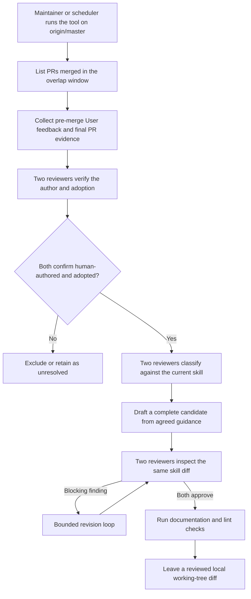

# Agent Note: dsh-code-review 的定期人工评审维护

Status: proposed

[English](2026-07-13-human-review-skill-maintenance.md) | 中文

## 问题

`dsh-code-review` skill（技能）记录需要评审人判断的失败模式，但一次性审计重复开展起来成本高昂，作用域也容易不一致。把每条评论都当作教训会让检查清单不断膨胀；把合并、讨论串已解决或作者回复「已修复」视为采纳证据，则会把最终代码可能并未落实的反馈提升为规则。维护流程需要足够的证据和独立评审，以便在证据不足时按不采纳处理，同时无需在工作流证明有用之前引入 webhook 服务、持久事件状态或自动仓库推广。

## 提案

在仓库外定期维护。一项保存在 skill 维护者机器上、而不提交到本仓库的私有工具，会针对刷新至 `origin/master` 的干净完整历史 checkout 运行。预期的调度器每天运行，并使用两天的 UTC 重叠窗口；手动运行可以通过另一个 `--since` 时长或重复的 `--pr` 参数指定显式集合。扫描相对于当前 skill 是幂等的，不存储仓库游标。推广时唯一会变更的仓库文件是 [.agents/skills/dsh-code-review/SKILL.md](../../../skills/dsh-code-review/SKILL.md)；draft PR（Pull Request）列出源反馈 URL 或 ID 和采纳证据，不会公开私有适配器日志。

### 采集约定

每个选定的 PR 都会在获取任何反馈前接受过滤：其 merge commit 必须是 `origin/master` 的祖先。merge commit 可达性是唯一的资格检查：直接 base 为功能分支的堆叠 PR，只要该 base 随后已经进入 master，就会被纳入，因为无论中间 stack 如何，评审人评论的代码此时已经在 master 上。工具还会解析落地 merge 的目标父级；无法重建的落地形态会记录到 `skipped-pulls.json` 并跳过。单个 PR 在预检、采集或证据收集时失败，只会被跳过，不会中止整次运行。如果时间窗口会超过 GitHub 搜索的 1,000 条结果上限，搜索阶段会明确失败，避免无提示地遗漏已合并 PR。采集阶段会完整读取内联评审评论、评审提交和 PR commit 的分页连接。不采集 PR 对话评论，因为强制推送后，GitHub 当前状态无法证明哪个仍然存在的 commit 位于评论之前，采纳约定因此必然会无条件排除这些评论。只有当 GitHub 报告 actor `type` 为 `User`，并且创建时间与最后编辑时间都严格早于 PR 合并时，工作流才接受已采集反馈；与合并同一时间戳的编辑视为合并后操作。评审提交使用 GraphQL 的 `lastEditedAt`，因为 REST 表示不含编辑时间。

### 采纳证据

每条反馈都携带稳定的来源 ID 和有界的变更证据。评审人的 `commit_id` 仍属于该 PR 时（强制推送场景无法确认即排除），工具会选择 committer 时间戳严格早于反馈的最新 PR commit 作为基线，而不是采用评审人点击的 commit，因为后者可能更旧。工具绝不会直接比较该基线与落地 merge：这种 diff 会混入不断前移的目标分支中的无关变更。相反，它会向采纳评审人提供两份 PR 专用 patch 快照。令 `B` 为反馈基线，`T` 为落地 merge 的目标父级，`M` 为落地 merge。反馈时快照是从 `merge-base(B, T)` 至 `B` 的树 diff；最终快照是从 `T` 至 `M` 的树 diff。因此，目标分支专有变更不会出现在任一 PR patch 中，而反馈后加入 PR 的变更只会出现在最终快照中。关联 commit 已因强制推送而不再属于该 PR 的评审、早于全部现存 PR commit 的反馈，以及无法重建目标父级的落地形态，会在任何评审人看到之前确定性地归类为 `unclear`。合并状态、已解决讨论串、作者回复「已修复」或同文件编辑只是上下文，不是采纳证明；PR 作者自己的评论绝不会进入适配器，因为它们不可能构成对作者自身意见的采纳。

### 双评审人分类与起草

两个独立配置的评审适配器，会对每个符合条件的条目分类：谁编写了它（`human-authored`、`forwarded-automation` 或 `unclear`），以及变更是否采纳了它（`adopted`、`rejected` 或 `unclear`）。只有两个适配器都判定为 `human-authored` 加 `adopted` 的条目才会继续。采纳集合随后会针对当前 skill 接受第二次独立分类：候选项、已经覆盖、特定于实现或并非反馈。单个条目即可符合要求，不要求重复出现。意见分歧会得到一次有界的重新评估；如果仍未解决，则继续保留在运行产物中。单个批次的适配器输出如果未通过 schema 或 id 校验，系统会在批次层按不采纳处理：其中的每条反馈都标记为 unclear 并路由到 `excluded`，而不是中止整次运行；有问题的原始输出会保存在该次运行的私有产物中，供调试使用。如果任一适配器在某项操作的任何非空批次中都没有返回有效结果，运行会以非零状态退出并发出失败记录，而不会报告「没有候选项」。

主适配器只根据结构化的共同指引起草，绝不接收原始评审文本。根据适配器作者的约定，它保持无工具且只读：返回完整的候选文件内容，由工具校验后写入唯一目标。两个适配器随后评审同一份完整 skill diff；阻塞性问题会进入有界修订循环，而且两者必须批准同一版修订。工具会在运行文档和 lint 检查前，以及报告成功前，再次拒绝暂存改动和目标 skill 之外的编辑，因此检查或并发进程无法通过添加其他路径混入。失败时，工具使用尽力而为的比较并交换回滚自身写入，以免覆盖维护者的并发编辑。成功时，它保存一份候选资料包，其中包含源 `origin/master` commit、源 skill blob ID、已评审 diff、完整候选文件、源反馈 ID 与 URL、落地证据范围、适配器判定和检查结果；它绝不提交、推送、打开或合并 PR。

### 评审适配器协议

每个私有可执行文件从 stdin 接收有字节上限、带版本的 JSON 请求，并在 stdout 返回有字节上限且符合 schema 的 JSON。两个评审命令解析为逐字节相同的可执行文件时，工具拒绝运行；这只是最低限度的机械检查；确保主适配器与次适配器由独立提供方或模型驱动，仍是部署运维方的责任。`access` 与 `tools` 字段是适配器作者承担的约定标记，不是 OS 沙箱：评审子进程在清理后的环境中 spawn，其 `cwd` 指向私有运行目录而非仓库根目录；反馈包装在带随机数的 `<untrusted-feedback nonce="…">` 块中，每个提示词都会要求模型把它视为数据；128 位随机数防止不受信任的正文伪造结束标签。每个子进程都采用有界、感知中止的进程树清理。适配器作者把每项操作实现为纯只读推理（inference）；即使 `edit` 操作也只会在 JSON 中返回完整候选内容，由工具校验后写入唯一目标。每个生产 `git`／`gh`／检查命令同样在清理后的环境中 spawn，避免 pre-push 钩子的路由变量无提示地重定向维护工具。候选写入与失败回滚会针对最近一次写入内容使用尽力而为的比较并交换；回滚还会取消暂存目标，避免由适配器或检查暂存的候选项在失败运行后遗留并进入之后的 commit。

### 推广约定

推广辅助工具从刷新至 `origin/master` 的干净 checkout 开始；当前 skill blob 与资料包中记录的源 blob 不同时，它拒绝应用候选项。运维方随后重新运行维护分析，或手动把 diff 变基后重新评审候选项；辅助工具绝不会用陈旧的完整文件输出替换较新的 `SKILL.md`。应用仍然有效的候选项后，它会打开 draft PR，其正文列出源反馈 URL 或 ID、用作采纳证据的落地 commit 范围、发起该候选项的运行、检查结果和任何运维方编辑。原始适配器提示词与响应保持私有，但仓库评审人会获得这些具体输入，从而判断每条提议规则是否确实来自已采纳的人类反馈。

### 机制所在位置

工具源码、适配器二进制文件、提供方凭据和预期的每日调度器保存在维护者机器上，不会提交到本仓库。本文规定协议，参考实现属于私有基础设施。该机制只服务于由单个运维方维护的一项 skill，因此，持续通过仓库评审审查机制改动的成本高于提交工具及其历史的收益。如果该机制将来移交给第二位维护者，移交工作需要一篇后续 Agent Note 来修订本决策；任何接手者都应从运维文档 [docs/cookbook/maintaining-dsh-code-review.md](../../../../docs/cookbook/maintaining-dsh-code-review.md) 入手。

## 考虑过的替代方案

- **把工具放入本仓库。** 对单维护者作用域不予采纳：仓库维护开销（类型检查、lint、覆盖率与横切重构）会超过已提交源码和评审历史的价值。未来移交时仍可重新考虑。
- **记录每条反馈产生时的 PR head**：不予采纳，因为这需要持续运行的观察器、持久事件状态、重试和强制推送协调。定期维护会在可用时使用经过评审的 commit 证据，并在整 PR 证据范围过宽、无法确认时直接排除。
- **持久化已处理 PR 游标**：不予采纳，因为带重叠的时间窗口扫描成本低廉，并且相对于当前 skill 天然幂等；游标状态反而带来恢复和漏事件问题。
- **每次新评论都运行**：不予采纳，因为一轮评审会产生许多相关评论，并且缺少判断采纳情况所需的最终产物。
- **把合并或讨论串解决视为采纳**：不予采纳，因为 PR 可能在反馈被拒绝、被取代或刻意不解决的情况下合并。
- **自动创建或合并仓库改动**：不予采纳，因为工具首先需要通过有用的定期输出积累可信记录。维护者检查并通过普通仓库评审推广本地 diff。
- **从已经修复的 bot 问题中学习**：不予采纳，因为来源约定限定为人类评审反馈。系统会在分析前按作者类型过滤，并通过作者检查排除转发自动化问题的人类账号。
- **让同一个评审人既当作者又作最终裁决**：不予采纳，因为独立判定能在不受支持的概括进入 skill 之前暴露问题。

## 验收标准

从 `proposed/` 推广到 `implemented/`，需要在针对本仓库的真实端到端运行中观察到以下全部事实：

- 私有工具从刷新至 `origin/master` 的干净 detached checkout 运行，并且要么报告「没有候选项」，要么只生成 `.agents/skills/dsh-code-review/SKILL.md` 的 working-tree diff。**2026-07-15 已观察：** 扫描 62 个已合并 PR，跳过 5 个（merge commit 不可达或采集超过 250 个 commit 的上限），考虑 426 条人类反馈，发现 0 个候选项。
- 两个评审适配器独立配置（不同的提供方或模型），无需用户干预即可完成 analyze／adopt／review 流程。**2026-07-15 已观察：** 不同的主／次适配器约用 8 分钟完成采纳与分析；一次适配器 id 幻觉由批次级保守失败机制处理，没有中止整次运行。
- 调度器在没有交互式终端的情况下触发工具，并通过持久通知通道把候选 diff（或「没有候选项」记录）送达运维方。
- 一个受控采集场景会在反馈基线之后，向目标分支加入与反馈匹配的变更；评审证据排除该目标分支专有变更，同时保留后续由 PR 自身加入的变更。
- 源 skill 改变后，推广辅助工具会拒绝候选项；仍然有效的候选项会打开 draft PR，其中包含上文定义的源反馈 ID、已采纳 commit 范围、发起该候选项的运行、检查和运维方编辑。
- 该工作流生成的至少一个候选 diff 会由运维方检查，并通过普通仓库 PR 评审推广到 `master`。该 PR 用以证明工作流能够把已采纳反馈转化为已交付的 skill 指引。

## 风险

- **根据 committer 时间戳推断因果关系。** 反馈 commit 基线通过比较 GitHub commit 时间戳与反馈创建时间戳选出；committer 时钟偏差与重写仍会留下误判采纳的残余窗口。与 GitHub 的 PR 事件流交叉比对可以进一步收紧，但需要采集定期工具作用域以外的事件。
- **两个「非候选项」分类结果会直接路由到 `excluded`，不进入争议轮次。** 两个分类器都判断「不是候选项」，但对非候选原因意见不一时（例如 `covered` 与 `specific`），该条目会被排除而不是重新评估。两个分类器都同意它不会形成新的评审行为，所以争议轮次不会改变结果。
- **超出字节哈希差异的双评审人独立性属于部署约定。** 两个命令解析为逐字节相同的可执行文件时，工具拒绝运行，但它无法验证两个不同包装层是否由不同提供方或模型驱动。运维方必须配置相互独立的主适配器与次适配器。
- **候选写入与回滚使用尽力而为的比较并交换。** POSIX 上基于文件的比较并交换并不真正原子；窗口持续一个事件循环周期。该工具面向单用户定期维护，不考虑真正并发的编辑器。
- **单维护者风险。** 由于机制位于单台机器，服务中断后，skill 维护会完全停止，直到运维方恢复服务，或通过一篇后续 Agent Note 把机制移交给新维护者。
