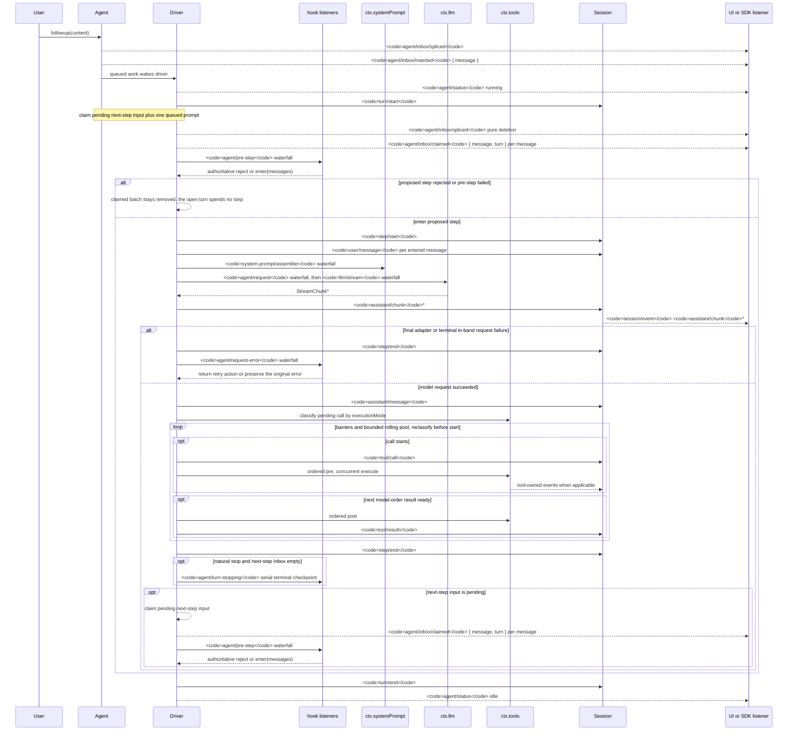

<!-- Generated by scripts/gen-doc-graphs.ts - do not edit by hand.
     Run `pnpm run gen-doc-graphs` to regenerate. -->

# Agent Turn And Step Lifecycle

This sequence is the visual companion to [architecture.md](architecture.md#turn-flow). It keeps durable replay facts on `session/event` and live control/status on `agent/*`.

The `assistant/message` event records every successful provider call, including content-less and `max-tokens` finishes. Empty content stays out of derived history, while the durable event keeps usage and `sourceEventSeqs` listing the exact `assistant/chunk` events, including an explicit empty list.

`dsh-compaction-basic` uses `agent/pre-step` for pressure before request derivation and `agent/request-error` only for canonical context overflow. Once either trigger qualifies, optional tool-result pruning runs before summary selection. Recovery works between the closed failed step and failed turn close, and opens a fresh retry turn only when pruning or summarization advances the surface replacement generation; otherwise the original request error remains authoritative.

The returned `agent/pre-step` decision is authoritative; listeners wrapping `next()` preserve downstream messages unless replacement is intentional. Steering and injected context pass through the same waterfall after a later claim operation takes their next-step batch.

SDK users that need replayable transcript data should consume `session/event`; `agent/*` is the live coordination API for queue/status, prompt interception, request construction, steering, continuation, and errors.

Maintenance mode: curated Mermaid sequence; exact event signatures live in the generated Cordis catalog.
