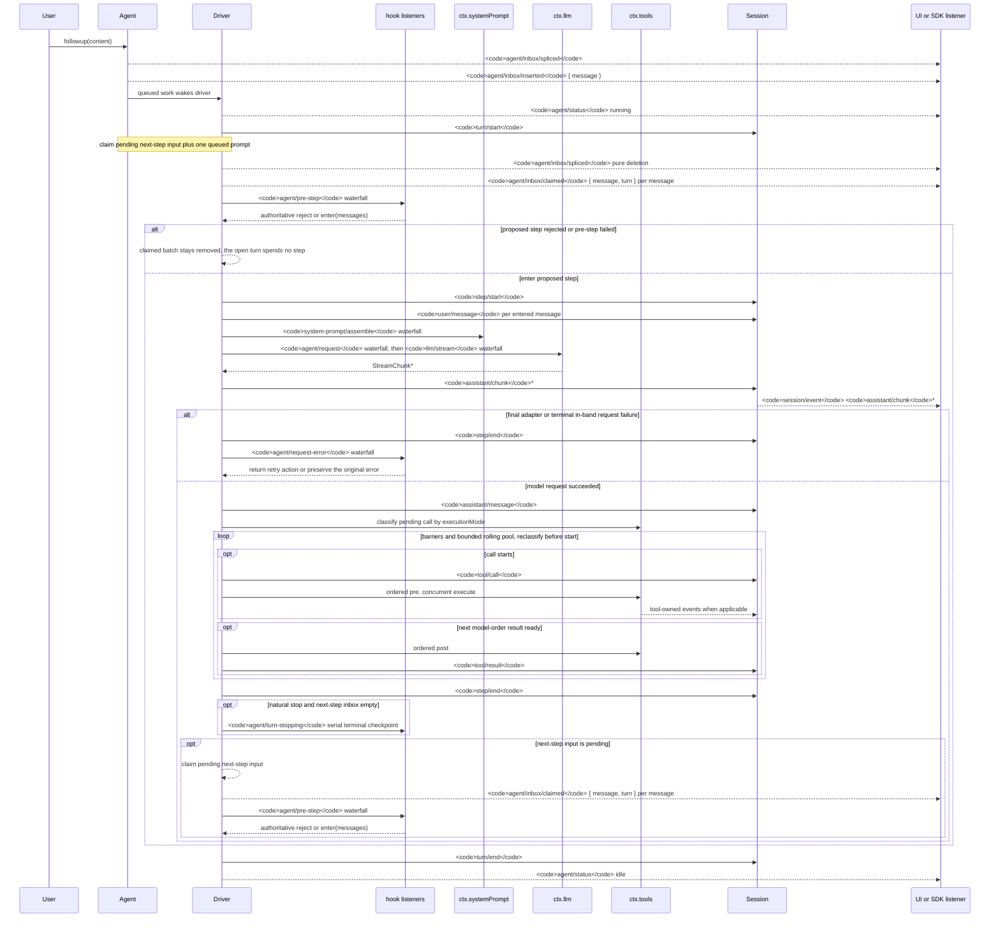

<!-- 英文源文件由 scripts/gen-doc-graphs.ts 生成；本中文文件是通过双语配对维护的经评审对侧。
     更新时先运行 `pnpm run gen-doc-graphs` 更新英文，再更新本文件并运行 `pnpm run verify-translation-pairing --write docs/agent-lifecycle.md` 重新记录配对。 -->

# Agent 轮次与步骤生命周期

[English](agent-lifecycle.md) | 中文

此时序图是 [architecture.md](architecture.md#turn-flow) 的配套图示。持久的回放事实保存在 `session/event` 中，实时控制与状态则保存在 `agent/*` 中。

`assistant/message` 事件会记录每次成功的提供方调用，包括返回空内容或以 `max-tokens` 结束的调用。空内容不会进入派生历史，但该持久事件仍会保留用量，并通过 `sourceEventSeqs` 精确列出对应的 `assistant/chunk` 事件，包括显式空列表。

`dsh-compaction-basic` 在派生请求之前通过 `agent/pre-step` 处理压力，而 `agent/request-error` 仅用于规范的上下文溢出。任一触发条件满足后，系统都会先执行可选的工具结果剪枝，再选择摘要。恢复发生在失败步骤结束之后、失败轮次结束之前；只有当剪枝或摘要生成推进了 surface replacement generation 时，系统才会开启一个全新的重试轮次，否则仍以原始请求错误为准。

以返回的 `agent/pre-step` 决策为准；通过包装 `next()` 的监听器会保留下游消息，除非有意替换这些消息。steering（中途引导）和注入的上下文在后续的认领操作取得其下一步骤批次后，会经过同一 waterfall（瀑布式事件）。

需要可回放 transcript（文本记录）数据的 SDK 用户应当消费 `session/event`；`agent/*` 是用于队列与状态、提示词拦截、请求构造、steering、继续执行和错误处理的实时协调接口。

维护模式：英文源文件包含人工维护的 Mermaid 时序图，并由生成器写出；本中文文件作为经评审对侧通过双语配对维护。确切的事件签名位于生成的 Cordis 目录中。
